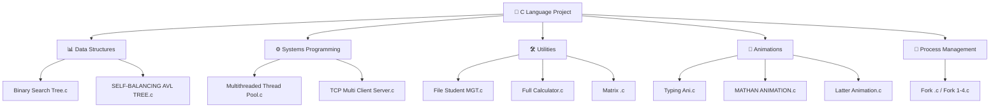

[⬅️ Back to C/C++/C# Projects](../README.md)

---
<h1 align="center">🔷 C Language Projects</h1>

<p align="center">
  
  
  
</p>

<p align="center">
  <i>Low-level systems, POSIX threading, TCP networking, and foundational data structures in pure C.</i>
</p>

---

## 🗂️ Quick Navigation
| 🏠 | ⚙️ | 🎮 | ☕ | 🐍 | 💎 | 🦀 |
|:---:|:---:|:---:|:---:|:---:|:---:|:---:|
| [Main](../../README.md) | [C/C++/C#](../README.md) | [JS Games](../../Games%20Using%20Vanilla%20JS/README.md) | [Java](../../Java%20Projects/README.md) | [Python](../../Python%20Projects/README.md) | [Ruby](../../Ruby%20Projects/README.md) | [Rust](../../Rust%20Projects/README.md) |

---

## 📋 Table of Contents
- [About the Project](#-about-the-project)
- [Folder Structure](#-folder-structure)
- [Key Features](#-key-features)
- [Tech Stack](#-tech-stack)
- [Getting Started](#-getting-started)
- [Author](#-author)

---

## 📖 About the Project

> A comprehensive collection of **C programming projects** underscoring low-level system interactions, data structures, and foundational algorithms. Spanning from simple calculators and dynamic animations to complex multi-threaded worker pools and TCP servers using `select()`, this directory demonstrates deep memory management and C systems programming.

---

## 📂 Folder Structure



---

## ✨ Key Features
- **TCP Multi-Client Server**: Implements a concurrent `select()`-based server capable of handling up to 30 simultaneous clients, returning HTTP-formatted HTML responses.
- **Multithreaded Worker Pool**: Uses POSIX `pthread` API (mutex locks + condition variables) to create a task queue dispatched across 4 worker threads — demonstrating efficient resource management.
- **Self-Balancing AVL Tree**: Full implementation of left/right rotations for balanced binary search on insertion, keeping O(log n) complexity intact.
- **Fork-Based Concurrency**: Multiple `fork()` examples demonstrating parent/child process lifecycle and IPC.
- **Console Animations**: Text-based terminal animations using `sleep()`, `system("clear")`, and ANSI terminal sequences.

---

## 🔧 Tech Stack
| Category | Details |
|---|---|
| **Language** | C (C99/C11) |
| **Compiler** | GCC, Clang (MinGW on Windows) |
| **Libraries** | `pthread.h`, `sys/socket.h`, `netinet/in.h`, `unistd.h`, `stdlib.h` |
| **APIs** | POSIX Threads, BSD Sockets |

---

## 🚀 Getting Started

### Prerequisites
Install **GCC** on your system.
- **Linux/macOS**: `sudo apt install gcc` or `brew install gcc`
- **Windows**: Install [MinGW-w64](https://www.mingw-w64.org/)

### Run Instructions

1. Navigate into this directory:
   ```bash
   cd "Academic-Projects-2024-2028/C C++ C# Projects/C Language Project"
   ```

2. **Compile** the desired file. Examples:

   | Program | Compile Command |
   |---|---|
   | Thread Pool | `gcc "Multithreaded Thread Pool.c" -o threadpool -pthread` |
   | TCP Server | `gcc "TCP Multi Client Server.c" -o server` |
   | AVL Tree | `gcc "SELF-BALANCING AVL TREE.c" -o avl` |
   | Calculator | `gcc "Full Calculator.c" -o calc` |

3. **Run** the compiled binary:
   ```bash
   ./threadpool
   ./server
   ```
   > ⚠️ Note: TCP-based programs require Linux/macOS or WSL on Windows due to POSIX socket dependencies.

---

## 👤 Author

**Manthan Vinzuda**
> *Academic Projects · 2024–2028*
