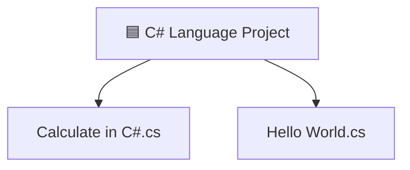

[⬅️ Back to C/C++/C# Projects](../README.md)

---
<h1 align="center">🟦 C# Language Projects</h1>

<p align="center">
  
  
</p>

<p align="center">
  <i>Entry into the .NET ecosystem — type-safe, structured, and enterprise-ready C# scripting.</i>
</p>

---

## 🗂️ Quick Navigation
| 🏠 | ⚙️ | 🎮 | ☕ | 🐍 | 💎 | 🦀 |
|:---:|:---:|:---:|:---:|:---:|:---:|:---:|
| [Main](../../README.md) | [C/C++/C#](../README.md) | [JS Games](../../Games%20Using%20Vanilla%20JS/README.md) | [Java](../../Java%20Projects/README.md) | [Python](../../Python%20Projects/README.md) | [Ruby](../../Ruby%20Projects/README.md) | [Rust](../../Rust%20Projects/README.md) |

---

## 📋 Table of Contents
- [About the Project](#-about-the-project)
- [Folder Structure](#-folder-structure)
- [Key Features](#-key-features)
- [Tech Stack](#-tech-stack)
- [Getting Started](#-getting-started)
- [Author](#-author)

---

## 📖 About the Project

> A dedicated directory for exploring the **C# language** and the **.NET ecosystem**. These scripts form a foundational understanding of type safety, structured OOP, and C#'s readable syntax — as a stepping stone toward building Windows desktop applications and enterprise-level back-end systems.

---

## 📂 Folder Structure



---

## ✨ Key Features
- **Typed Arithmetic**: `Calculate in C#.cs` demonstrates strongly-typed numeric input parsing, operator handling, and formatted output.
- **Console I/O**: Standard C# `Console.ReadLine()` / `Console.WriteLine()` patterns for interactive text-based programs.
- **Entry Point Structure**: Properly structured `static void Main(string[] args)` entry points following .NET conventions.

---

## 🔧 Tech Stack
| Category | Details |
|---|---|
| **Language** | C# |
| **Runtime** | .NET Core / .NET Framework |
| **Compiler** | `csc` (C# Compiler) or `dotnet CLI` |

---

## 🚀 Getting Started

### Prerequisites
Install the **.NET SDK** from [dotnet.microsoft.com](https://dotnet.microsoft.com/download). Verify with:
```bash
dotnet --version
```

### Run Instructions

1. Navigate into this directory:
   ```bash
   cd "Academic-Projects-2024-2028/C C++ C# Projects/C# Language Project"
   ```

2. **Compile** a C# file using the compiler:
   ```bash
   csc "Calculate in C#.cs"
   ```

3. **Run** the resulting executable:
   ```bash
   ./"Calculate in C#.exe"    # Linux/macOS via Mono
   "Calculate in C#.exe"      # Windows
   ```

   > 💡 On modern systems, you can also use the `dotnet-script` tool:
   > ```bash
   > dotnet script "Calculate in C#.cs"
   > ```

---

## 👤 Author

**Manthan Vinzuda**
> *Academic Projects · 2024–2028*
