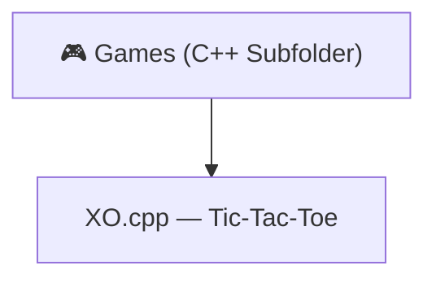

[⬅️ Back to C++ Language Project](../README.md)

---
<h1 align="center">🎮 C++ Terminal Games</h1>

<p align="center">
  
  
</p>

<p align="center">
  <i>Classic interactive terminal games implemented in native C++.</i>
</p>

---

## 🗂️ Quick Navigation
| 🏠 | ⚙️ | 🎮 | ☕ | 🐍 | 💎 | 🦀 |
|:---:|:---:|:---:|:---:|:---:|:---:|:---:|
| [Main](../../../README.md) | [C/C++/C#](../../README.md) | [JS Games](../../../Games%20Using%20Vanilla%20JS/README.md) | [Java](../../../Java%20Projects/README.md) | [Python](../../../Python%20Projects/README.md) | [Ruby](../../../Ruby%20Projects/README.md) | [Rust](../../../Rust%20Projects/README.md) |

---

## 📋 Table of Contents
- [About the Project](#-about-the-project)
- [Folder Structure](#-folder-structure)
- [Key Features](#-key-features)
- [Tech Stack](#-tech-stack)
- [Getting Started](#-getting-started)
- [Author](#-author)

---

## 📖 About the Project

> Nestled within the C++ Language Project, this **Games** subfolder hosts interactive, terminal-based native games written purely in C++. It demonstrates how to manage complex game-state loops, 2D board rendering, and turn-based system mechanics without any external game engine.

---

## 📂 Folder Structure



---

## ✨ Key Features
- **Turn-Based Mechanics**: Classic 2-player Tic-Tac-Toe (XO) rendered on a 3×3 console grid.
- **Win Detection**: Systematically checks all 8 win conditions (rows, columns, diagonals) after every move.
- **Draw Detection**: Detects a stalemate when all 9 cells are filled with no winner.
- **Input Validation**: Rejects invalid moves (already occupied cells or out-of-bound positions).

---

## 🔧 Tech Stack
| Category | Details |
|---|---|
| **Language** | C++ |
| **Compiler** | `g++`, `clang++`, MSVC |

---

## 🚀 Getting Started

### Prerequisites
A C++ compiler is required. Install `g++` from [gcc.gnu.org](https://gcc.gnu.org/).

### Run Instructions

1. Navigate to this directory:
   ```bash
   cd "Academic-Projects-2024-2028/C C++ C# Projects/C++ Language Project/Games"
   ```

2. Compile the game:
   ```bash
   g++ XO.cpp -o xo_game
   ```

3. Launch and play:
   ```bash
   ./xo_game
   ```

---

## 👤 Author

**Manthan Vinzuda**
> *Academic Projects · 2024–2028*
