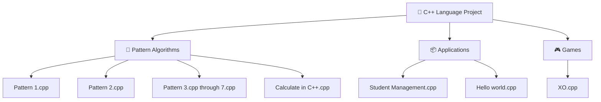

[⬅️ Back to C/C++/C# Projects](../README.md)

---
<h1 align="center">🔵 C++ Language Projects</h1>

<p align="center">
  
  
  
</p>

<p align="center">
  <i>Object-Oriented Programming, STL containers, pattern algorithms, and console-based CRUD systems.</i>
</p>

---

## 🗂️ Quick Navigation
| 🏠 | ⚙️ | 🎮 | ☕ | 🐍 | 💎 | 🦀 |
|:---:|:---:|:---:|:---:|:---:|:---:|:---:|
| [Main](../../README.md) | [C/C++/C#](../README.md) | [JS Games](../../Games%20Using%20Vanilla%20JS/README.md) | [Java](../../Java%20Projects/README.md) | [Python](../../Python%20Projects/README.md) | [Ruby](../../Ruby%20Projects/README.md) | [Rust](../../Rust%20Projects/README.md) |

---

## 📋 Table of Contents
- [About the Project](#-about-the-project)
- [Folder Structure](#-folder-structure)
- [Key Features](#-key-features)
- [Tech Stack](#-tech-stack)
- [Getting Started](#-getting-started)
- [Author](#-author)

---

## 📖 About the Project

> Explores **Object-Oriented Programming (OOP)** concepts, logic building, and problem-solving through **C++**. Spanning from foundational nested-loop pattern builders to fully interactive terminal-based CRUD systems backed by `std::vector`, this directory captures structured C++ development for academic mastery.

---

## 📂 Folder Structure



---

## ✨ Key Features
- **CRUD via STL `std::vector`**: `Student Management.cpp` builds a full in-memory student database supporting add, view, search by ID, and delete operations.
- **Pattern Logic**: Seven distinct star/shape pattern generators building deep comprehension of nested `for` loops and memory output.
- **Input Validation**: Uses `cin.fail()` checks and buffer clearing (`cin.ignore()`) to prevent runtime crashes on invalid input.
- **Games Subdirectory**: Console-based XO (Tic-Tac-Toe) game separated into a clean subdirectory.

---

## 🔧 Tech Stack
| Category | Details |
|---|---|
| **Language** | C++ (C++11 or newer) |
| **Compiler** | `g++`, `clang++`, or MSVC |
| **Libraries** | `<iostream>`, `<vector>`, `<string>`, `<algorithm>` |

---

## 🚀 Getting Started

### Prerequisites
A C++ compiler is necessary. Verify `g++` installation:
```bash
g++ --version
```

### Run Instructions

1. Navigate into this directory:
   ```bash
   cd "Academic-Projects-2024-2028/C C++ C# Projects/C++ Language Project"
   ```

2. **Compile** the desired source file:

   | Program | Compile Command |
   |---|---|
   | Student Management | `g++ "Student Management.cpp" -o student_mgt` |
   | Pattern Builder | `g++ "Pattern 1.cpp" -o pattern1` |
   | Calculator | `g++ "Calculate in C++.cpp" -o calc_cpp` |
   | XO Game | `g++ Games/XO.cpp -o xo_game` |

3. **Run** the compiled binary:
   ```bash
   ./student_mgt
   ```

---

## 👤 Author

**Manthan Vinzuda**
> *Academic Projects · 2024–2028*
