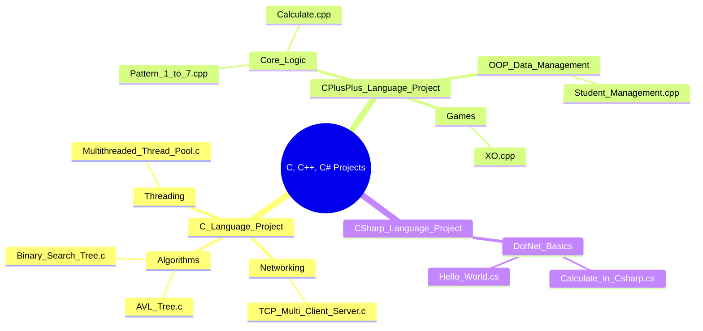

[⬅️ Back to Main Repository](../README.md)

---
<h1 align="center">⚙️ C, C++, & C# Academic Projects</h1>

  
  
  

  <i>Low-level systems, memory management, OOP design, and enterprise logic — in three languages.</i>

---

## 🗂️ Quick Navigation
| 🏠 | ⚙️ | 🎮 | ☕ | 🐍 | 💎 | 🦀 |
|:---:|:---:|:---:|:---:|:---:|:---:|:---:|
| [Main](../README.md) | **C/C++/C#** | [JS Games](../Games%20Using%20Vanilla%20JS/README.md) | [Java](../Java%20Projects/README.md) | [Python](../Python%20Projects/README.md) | [Ruby](../Ruby%20Projects/README.md) | [Rust](../Rust%20Projects/README.md) |

---

## 📋 Table of Contents
- [About the Project](#-about-the-project)
- [Folder Structure](#-folder-structure)
- [Key Features](#-key-features)
- [Tech Stack](#-tech-stack)
- [Getting Started](#-getting-started)
- [Author](#-author)

---

## 📖 About the Project

> This top-level directory serves as an umbrella for low-level systems architecture, procedural scripts, algorithmiclogic implementations, and object-oriented designs. By combining **C**, **C++**, and **C#**, this section builds a thorough understanding of computer memory interactions, concurrency, tree structures, and enterprise logic patterns.

---

## 📂 Folder Structure

---

## ✨ Key Features
- **Language Hierarchy**: Modularly separated into three distinct runtime environments and language idioms.
- **From Bare Metal to Enterprise**: Transition seamlessly from raw C pointers and POSIX threads to standard C++ template vectors and memory-safe C# constructs.
- **Systems-Level Programming**: Includes a TCP Server handling 30+ clients and a full Multithreaded Thread Pool.
- **Academic Progression**: Demonstrates a logical academic progression from fundamental console programs to complete network server implementations.

---

## 🔧 Tech Stack
| Language | Tools/Compiler | Key Libraries |
|---|---|---|
| **C** | GCC / Clang / MinGW | `pthread.h`, `sys/socket.h`, `stdlib.h` |
| **C++** | G++ / MSVC | `<iostream>`, `<vector>`, `<string>` |
| **C#** | .NET SDK, `csc` | `System`, .NET Core |

---

## 🚀 Getting Started

Please navigate into the respective subdirectories for specific execution commands.

| Subdirectory | Description |
|---|---|
| [📁 C Language Project](./C%20Language%20Project/README.md) | Networking, threading, DSA in C |
| [📁 C++ Language Project](./C%2B%2B%20Language%20Project/README.md) | OOP, patterns, games in C++ |
| [📁 C# Language Project](./C%23%20Language%20Project/README.md) | .NET scripts and enterprise basics |

---

## 👤 Author

**Manthan Vinzuda**
> *Academic Projects · 2024–2028*
