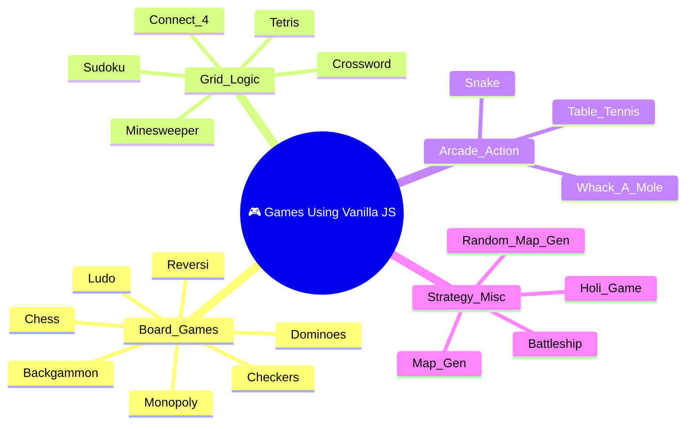

[⬅️ Back to Main Repository](../README.md)

---
<h1 align="center">🎮 Vanilla JS Game Suite</h1>

<p align="center">
  
  
  
  
  
</p>

<p align="center">
  <i>20+ browser-based games built with zero dependencies — pure DOM manipulation, Canvas, and Web Audio.</i>
</p>

---

## 🗂️ Quick Navigation
| 🏠 | ⚙️ | 🎮 | ☕ | 🐍 | 💎 | 🦀 |
|:---:|:---:|:---:|:---:|:---:|:---:|:---:|
| [Main](../README.md) | [C/C++/C#](../C%20C%2B%2B%20C%23%20Projects/README.md) | **JS Games** | [Java](../Java%20Projects/README.md) | [Python](../Python%20Projects/README.md) | [Ruby](../Ruby%20Projects/README.md) | [Rust](../Rust%20Projects/README.md) |

---

## 📋 Table of Contents
- [About the Project](#-about-the-project)
- [Game Catalogue](#-game-catalogue)
- [Folder Structure](#-folder-structure)
- [Key Features](#-key-features)
- [Tech Stack](#-tech-stack)
- [Getting Started](#-getting-started)
- [Author](#-author)

---

## 📖 About the Project

> A massive collection of fully playable, browser-based games built entirely from scratch — **no React, no Vue, no Unity, no Phaser**. By leveraging raw DOM manipulation, the HTML5 `<canvas>` API, and the Web Audio API, these projects push the absolute limits of Vanilla JavaScript. From classic board strategies like Chess and Backgammon to grid-logic titans like Minesweeper and Sudoku, this suite is a testament to raw algorithmic thinking translated directly into the DOM.

---

## 🕹️ Game Catalogue

| # | Game | Tech Highlights |
|---|---|---|
| 1 | ♟️ **Chess** | Full move validation, AI opponent, Check/Checkmate detection |
| 2 | 🎲 **Ludo** | Turn-based dice-roll mechanics, 4-player token logic |
| 3 | 🏓 **Table Tennis** | Canvas-based physics with ball velocity & paddle collisions |
| 4 | ❌ **XO Game** | DOM manipulation, 2-player turn logic |
| 5 | 🧩 **Minesweeper** | BFS flood-fill reveal, Web Audio synth sounds, particle effects |
| 6 | 🟨 **Tetris** | Gravity system, line clearing, piece rotation |
| 7 | 🐍 **Snake** | Grid movement, food spawning, self-collision detection |
| 8 | 🎯 **Connect 4** | Column-drop physics, win-detection in 4 directions |
| 9 | 📸 **Sudoku** | Backtracking puzzle generator and validator |
| 10 | 🔲 **Checkers** | Forced-capture rules, king promotion |
| 11 | 🎲 **Backgammon** | Board rendering, dice rules |
| 12 | 🌀 **Reversi** | Flip-mechanics on 8 directions |
| 13 | 🌺 **Holi Game** | Canvas particle spray game |
| 14 | 🗺️ **Map / Random Map Gen** | Procedural map generation algorithms |
| 15 | 📝 **Crossword** | Word-grid placement and clue detection |
| 16 | 🟰 **Dominoes** | Tile-matching game logic |

---

## 📂 Folder Structure



---

## ✨ Key Features
- **Zero External Dependencies**: 100% pure Vanilla JS, CSS3, and HTML5. No library, framework, or package needed.
- **Complex Game State**: `gameState` singleton objects cleanly manage turn-switching, valid-move computation, board representations, and win conditions.
- **Synthesized Audio**: Uses the `AudioContext` API to procedurally generate sounds (beeps, explosions, victory chimes) at runtime — no static MP3 files needed.
- **Canvas Particle Engine**: Minesweeper and others implement full `requestAnimationFrame` loops with custom particle physics (dust, stars, confetti, comic explosions).
- **AI Opponent**: Chess has a randomized AI opponent selectable from the menu.
- **Touch & Mobile Support**: Event listeners handle both `mousedown/up` and `touchstart/end` for cross-device play.

---

## 🔧 Tech Stack
| Category | Details |
|---|---|
| **Languages** | HTML5, CSS3, JavaScript (ES6+) |
| **Layout Engine** | CSS Grid, Flexbox |
| **Graphics** | HTML5 Canvas API (`2d` context) |
| **Audio** | Web Audio API (`AudioContext`) |
| **Events** | DOM Event Listeners (mouse & touch) |

---

## 🚀 Getting Started

### Prerequisites
All you need is a **modern web browser** (Chrome, Firefox, Safari, or Edge). No installation required.

### Run Instructions

**Option 1 — Direct File Open (Easiest)**
Simply double-click any `.html` file to open it in your browser:
- `Chess Index.html`
- `Minesweeper Index.html`
- `Tetris Index.html`

**Option 2 — VS Code Live Server (Recommended)**
1. Open the folder in VS Code.
2. Right-click any `Index.html` → **"Open with Live Server"**.

**Option 3 — Python Dev Server**
```bash
cd "Games Using Vanilla JS"
python -m http.server 8000
```
Then open `http://localhost:8000` in your browser.

---

## 👤 Author

**Manthan Vinzuda**
> *Academic Projects · 2024–2028*
