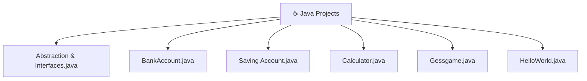

[⬅️ Back to Main Repository](../README.md)

---
<h1 align="center">☕ Java Projects</h1>

<p align="center">
  
  
  
</p>

<p align="center">
  <i>Object-Oriented Programming, Java Swing GUIs, banking logic, and console-based applications.</i>
</p>

---

## 🗂️ Quick Navigation
| 🏠 | ⚙️ | 🎮 | ☕ | 🐍 | 💎 | 🦀 |
|:---:|:---:|:---:|:---:|:---:|:---:|:---:|
| [Main](../README.md) | [C/C++/C#](../C%20C%2B%2B%20C%23%20Projects/README.md) | [JS Games](../Games%20Using%20Vanilla%20JS/README.md) | **Java** | [Python](../Python%20Projects/README.md) | [Ruby](../Ruby%20Projects/README.md) | [Rust](../Rust%20Projects/README.md) |

---

## 📋 Table of Contents
- [About the Project](#-about-the-project)
- [Folder Structure](#-folder-structure)
- [Key Features](#-key-features)
- [Tech Stack](#-tech-stack)
- [Getting Started](#-getting-started)
- [Author](#-author)

---

## 📖 About the Project

> A focused exploration of **Object-Oriented Programming using Java**, demonstrating core design principles including Classes, Encapsulation, Inheritance, Abstraction, and Interfaces. Ranges from simple `HelloWorld.java` bootstraps to a fully interactive keyboard-enabled Swing **desktop calculator**, all the way to OOP-driven banking simulation classes.

---

## 📂 Folder Structure



---

## ✨ Key Features
- **Java Swing Desktop Calculator**: `Calculator.java` implements a fully functional, click-and-keyboard-driven calculator using `javax.swing`, `java.awt`, and `ActionListener`/`KeyListener` interfaces. Handles division by zero gracefully.
- **OOP Banking Simulation**: `BankAccount.java` demonstrates encapsulation perfectly — `private` balance fields accessed only via constructor, `deposit()`, `withdraw()`, and `displayStatus()` methods.
- **Abstraction & Interfaces**: `Abstraction & Interfaces.java` implements core OOP interface contracts and abstract class hierarchies.
- **Console I/O**: Leverages `java.util.Scanner` across files for interactive terminal sessions with proper input buffer flushing.

---

## 🔧 Tech Stack
| Category | Details |
|---|---|
| **Language** | Java (JDK 8+) |
| **GUI Framework** | `javax.swing`, `java.awt` |
| **Libraries** | `java.util.Scanner`, `java.awt.event.*` |
| **Build** | `javac` (JDK compiler) |

---

## 🚀 Getting Started

### Prerequisites
Install the **Java Development Kit (JDK)**. Verify with:
```bash
javac -version
java -version
```

### Run Instructions

1. Navigate to this directory:
   ```bash
   cd "Academic-Projects-2024-2028/Java Projects"
   ```

2. **Compile** the file:

   | Program | Compile Command |  
   |---|---|
   | Calculator (GUI) | `javac Calculator.java` |
   | Bank Account | `javac BankAccount.java` |
   | Guessing Game | `javac Gessgame.java` |

3. **Run** the compiled class:
   ```bash
   java Calculator
   java Gessgame
   ```
   > ⚠️ Do NOT include the `.class` extension when running with `java`.

   > 💡 The Calculator will open a native desktop GUI window.

---

## 👤 Author

**Manthan Vinzuda**
> *Academic Projects · 2024–2028*
