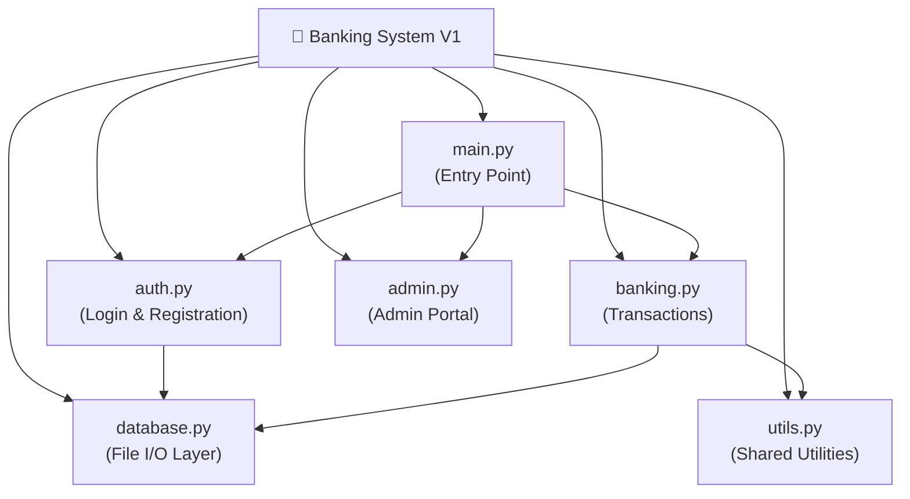

[⬅️ Back to Python Projects](../README.md)

---
<h1 align="center">🏦 Banking System V1</h1>

<p align="center">
  
  
  
</p>

<p align="center">
  <i>A modular, multi-file CLI banking simulator with auth, admin portal, and transaction history.</i>
</p>

---

## 🗂️ Quick Navigation
| 🏠 | 🐍 |
|:---:|:---:|
| [Main](../../README.md) | [Python Projects](../README.md) |

---

## 📋 Table of Contents
- [About the Project](#-about-the-project)
- [Folder Structure](#-folder-structure)
- [Key Features](#-key-features)
- [Tech Stack](#-tech-stack)
- [Getting Started](#-getting-started)
- [Author](#-author)

---

## 📖 About the Project

> **Banking System V1** is a highly modular, terminal-based financial management simulation. Built using enterprise-grade responsibility separation, it correctly delegates authentication, flat-file database I/O, banking operations, and an administrative portal to dedicated Python modules — mimicking the architectural patterns of real-world banking software.

---

## 📂 Folder Structure



---

## ✨ Key Features
- **Authentication**: Secure user registration, login with password verification, and account deletion.
- **Admin Portal**: Password-protected admin dashboard for viewing system-wide statistics.
- **Full Transaction Suite**: Supports Deposit, Withdrawal, Balance Inquiry, Fund Transfer, and Transaction History.
- **Interest Application**: Simulates monthly compound interest for savings account balances.
- **Colorama Terminal UX**: Styled console output using color highlights (`Fore.GREEN`, `Fore.RED`) from `colorama` for a polished terminal experience.
- **Graceful Shutdown**: `KeyboardInterrupt` handling ensures data is preserved on force-quit.

---

## 🔧 Tech Stack
| Category | Details |
|---|---|
| **Language** | Python 3.x |
| **Interface** | CLI (Terminal / Command Line) |
| **Libraries** | `colorama`, `sys`, `time` |
| **Data Store** | File-based (plain-text or JSON) |

---

## 🚀 Getting Started

### Prerequisites
Install the required package:
```bash
pip install colorama
```

### Run Instructions

1. Navigate into the folder:
   ```bash
   cd "Academic-Projects-2024-2028/Python Projects/Banking System V1"
   ```

2. Launch the application:
   ```bash
   python main.py
   ```

3. From the main menu, select:
   - `1` → Login
   - `2` → Open New Account
   - `3` → Admin Portal
   - `0` → Exit

---

## 👤 Author

**Manthan Vinzuda**
> *Academic Projects · 2024–2028*
