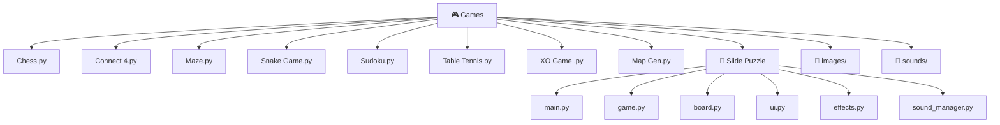

[⬅️ Back to Python Projects](../README.md)

---
<h1 align="center">🎮 Python Games Suite</h1>

<p align="center">
  
  
  
</p>

<p align="center">
  <i>A rich collection of graphical and logic-based games in Python — from Tkinter boards to full Pygame apps.</i>
</p>

---

## 🗂️ Quick Navigation
| 🏠 | 🐍 |
|:---:|:---:|
| [Main](../../README.md) | [Python Projects](../README.md) |

---

## 📋 Table of Contents
- [About the Project](#-about-the-project)
- [Game Index](#-game-index)
- [Folder Structure](#-folder-structure)
- [Key Features](#-key-features)
- [Tech Stack](#-tech-stack)
- [Getting Started](#-getting-started)
- [Author](#-author)

---

## 📖 About the Project

> This subdirectory holds an expansive array of graphical and logic-based games developed in Python. Utilizing external engines like **Pygame** along with built-in **Tkinter**, these games range from classic board game implementations (Chess, Sudoku, Connect 4) all the way to fully modular Pygame applications with sound management and visual effects.

---

## 🕹️ Game Index

| Game | File | Engine |
|---|---|---|
| ♟️ Chess | `Chess.py` | Tkinter + images |
| 🧩 Sudoku | `Sudoku.py` | Tkinter |
| 🔴 Connect 4 | `Connect 4.py` | Tkinter |
| 🐍 Snake Game | `Snake Game.py` | Tkinter |
| 🏓 Table Tennis | `Table Tennis.py` | Tkinter / Canvas |
| ❌ XO Game | `XO Game .py` | Tkinter |
| 🗺️ Map Gen | `Map Gen.py` | Procedural Algo |
| 🌀 Maze | `Maze.py` | Recursive DFS |
| 🧩 Slide Puzzle | `Slide Puzzle/` | **Pygame** (full app) |

---

## 📂 Folder Structure



---

## ✨ Key Features
- **Pygame Asset Pipeline**: The Slide Puzzle loads real chess piece images from the `images/` folder and MP3 sound effects from `sounds/`.
- **Recursive DFS Maze Generation**: `Maze.py` uses depth-first search to carve a perfect maze through a grid before rendering it.
- **Modular Pygame App**: `Slide Puzzle` is split into dedicated modules for game state, board logic, effects, sound, UI, and settings.
- **Grid-Based Logic**: Connect 4 and Sudoku implement multi-dimensional array validations and win-condition scans.

---

## 🔧 Tech Stack
| Category | Details |
|---|---|
| **Language** | Python 3.x |
| **GUI** | `tkinter`, `pygame` |
| **Assets** | PNG images (`images/`), MP3 audio (`sounds/`) |

---

## 🚀 Getting Started

### Prerequisites
```bash
pip install pygame
```

### Run Instructions

1. Navigate to the Games folder:
   ```bash
   cd "Academic-Projects-2024-2028/Python Projects/Games"
   ```

2. Run any standalone game:
   ```bash
   python "Chess.py"
   python "Snake Game.py"
   python "Connect 4.py"
   ```

3. For the Slide Puzzle application:
   ```bash
   cd "Slide Puzzle"
   python main.py
   ```

---

## 👤 Author

**Manthan Vinzuda**
> *Academic Projects · 2024–2028*
