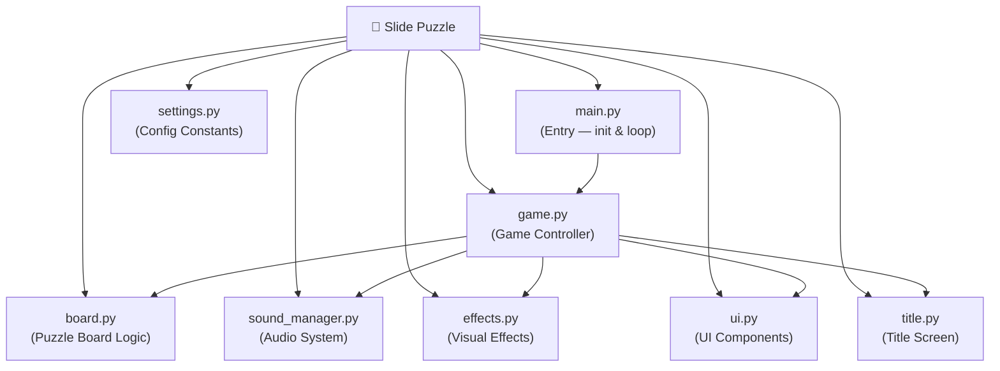

[⬅️ Back to Python Games](../README.md)

---
<h1 align="center">🧩 Pygame Slide Puzzle</h1>

<p align="center">
  
  
  
</p>

<p align="center">
  <i>A fully modular, Pygame-powered sliding tile puzzle game with sound, effects, and a clean game loop.</i>
</p>

---

## 🗂️ Quick Navigation
| 🏠 | 🐍 | 🎮 |
|:---:|:---:|:---:|
| [Main](../../../README.md) | [Python Projects](../../README.md) | [Games](../README.md) |

---

## 📋 Table of Contents
- [About the Project](#-about-the-project)
- [Folder Structure](#-folder-structure)
- [Key Features](#-key-features)
- [Tech Stack](#-tech-stack)
- [Getting Started](#-getting-started)
- [Author](#-author)

---

## 📖 About the Project

> **Slide Puzzle** is an interactive graphical game built using the **Pygame** multimedia library. Unlike the other single-file games in this repository, this project is split into a scalable application architecture featuring a custom game loop, dedicated board generation logic, interactive UI elements, dynamic sound management, and visual effects rendering — demonstrating professional-grade Python game development patterns.

---

## 📂 Folder Structure



---

## ✨ Key Features
- **Standard Pygame Game Loop**: `main.py` initializes Pygame, instantiates the `Game()` controller, calls `app.run()`, and ensures clean exit via `pygame.quit()`.
- **Modular Subsystems**: Responsibilities are cleanly isolated — `board.py` handles tile state, `effects.py` handles animations, `sound_manager.py` manages audio loading.
- **Sound Integration**: Loads and triggers MP3 sound effects from the `sounds/` directory on tile moves, wins, etc.
- **Settings-Driven Config**: `settings.py` centralizes all game constants (grid size, colors, FPS) making configuration trivial.

---

## 🔧 Tech Stack
| Category | Details |
|---|---|
| **Language** | Python 3.x |
| **Engine** | Pygame |
| **Assets** | MP3 audio files in `sounds/` |

---

## 🚀 Getting Started

### Prerequisites
```bash
pip install pygame
```

### Run Instructions

1. Navigate into the project folder:
   ```bash
   cd "Academic-Projects-2024-2028/Python Projects/Games/Slide Puzzle"
   ```

2. Launch the game:
   ```bash
   python main.py
   ```

---

## 👤 Author

**Manthan Vinzuda**
> *Academic Projects · 2024–2028*
