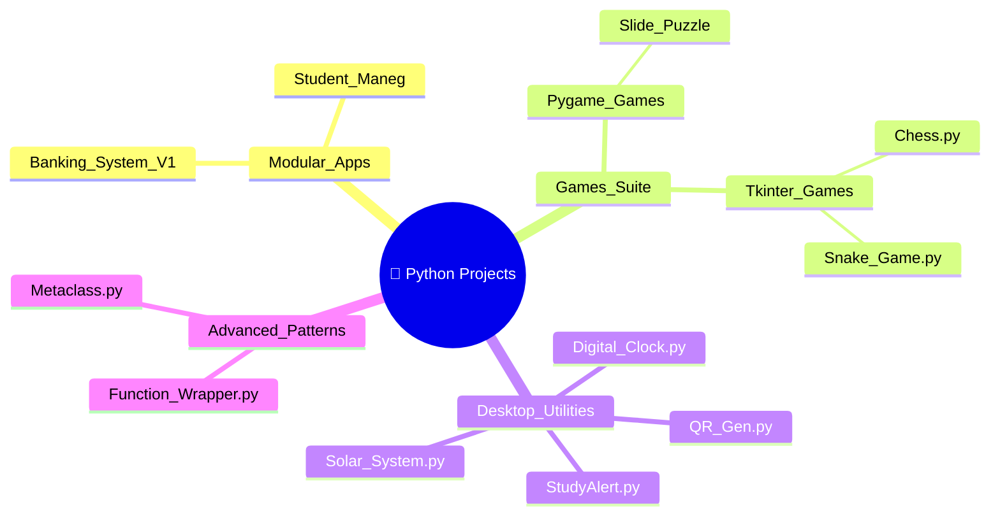

[⬅️ Back to Main Repository](../README.md)

---
<h1 align="center">🐍 Python Projects</h1>

<p align="center">
  
  
  
  
</p>

<p align="center">
  <i>Applications, games, design patterns, and utility scripts in Python — from console to GUI.</i>
</p>

---

## 🗂️ Quick Navigation
| 🏠 | ⚙️ | 🎮 | ☕ | 🐍 | 💎 | 🦀 |
|:---:|:---:|:---:|:---:|:---:|:---:|:---:|
| [Main](../README.md) | [C/C++/C#](../C%20C%2B%2B%20C%23%20Projects/README.md) | [JS Games](../Games%20Using%20Vanilla%20JS/README.md) | [Java](../Java%20Projects/README.md) | **Python** | [Ruby](../Ruby%20Projects/README.md) | [Rust](../Rust%20Projects/README.md) |

---

## 📋 Table of Contents
- [About the Project](#-about-the-project)
- [Project Index](#-project-index)
- [Folder Structure](#-folder-structure)
- [Key Features](#-key-features)
- [Tech Stack](#-tech-stack)
- [Getting Started](#-getting-started)
- [Author](#-author)

---

## 📖 About the Project

> This comprehensive directory showcases **Python's massive versatility**. Containing a mix of desktop applications, terminal-based database systems, classic logic games, and advanced academic design patterns (Decorators/Wrappers and Metaclasses), this directory demonstrates proficiency across scripting, GUI programming (Tkinter/Pygame), and structural data management in Python.

---

## 📁 Project Index

| Project | Location | Description |
|---|---|---|
| 🏦 Banking System V1 | [📁 View README](./Banking%20System%20V1/README.md) | Full-featured CLI banking simulator |
| 🎮 Games Suite | [📁 View README](./Games/README.md) | Pygame + Tkinter game collection |
| 🧩 Slide Puzzle | [📁 View README](./Games/Slide%20Puzzle/README.md) | Modular Pygame sliding tile game |
| 👨‍🎓 Student Management | [📁 View README](./Student_Maneg/README.md) | JSON-backed CRUD student records |
| ⏰ Digital Clock | `Digital Clock .py` | Tkinter animated clock UI |
| 🌞 Solar System | `Solar System .py` | Physics-based planetary orbit sim |
| 🔢 QR Generator | `QR Gen.py` | Generates QR codes from user input |
| 📐 Pythagoras Tree | `Pythagoras Tree.py` | Recursive fractal tree renderer |
| 🌀 Maze | `Maze.py` | DFS-generated interactive maze |
| 🧠 Wrapper Pattern | `The Function Wrapper Pattern.py` | Python decorator implementation |
| 🔮 Metaclass | `The Mataclass.py` | Python metaclass exploration |

---

## 📂 Folder Structure



---

## ✨ Key Features
- **Application Modularity**: `Banking System V1` and `Student_Maneg` both split complex systems into multiple files (`auth.py`, `database.py`, `main.py`) for enterprise-grade scalability.
- **Game Development**: Games directory contains Pygame-rendered experiences and terminal-based logic games.
- **Design Patterns**: Deep dives into Python's dynamic nature via Metaclasses and Function Wrapper Decorators.
- **Utility Scripts**: Highly functional desktop tools — study alerts, fractal renderers, QR code generators, and solar system simulators.

---

## 🔧 Tech Stack
| Library/Area | Details |
|---|---|
| **Language** | Python 3.x |
| **GUI** | `tkinter`, `pygame` |
| **Standard Libs** | `sys`, `time`, `json`, `os`, `math` |
| **Packages** | `pygame`, `qrcode`, `colorama` |

---

## 🚀 Getting Started

### Prerequisites
Install Python 3. Then install optional dependencies:
```bash
pip install pygame qrcode[pil] colorama
```

### Run Instructions

1. Navigate to this directory:
   ```bash
   cd "Academic-Projects-2024-2028/Python Projects"
   ```

2. Run standalone scripts directly:
   ```bash
   python "Digital Clock .py"
   python "Solar System .py"
   python "QR Gen.py"
   ```

3. For modular sub-projects, navigate into each folder:
   ```bash
   cd "Banking System V1"
   python main.py
   ```

---

## 👤 Author

**Manthan Vinzuda**
> *Academic Projects · 2024–2028*
