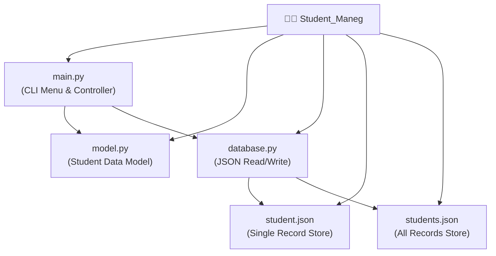

[⬅️ Back to Python Projects](../README.md)

---
<h1 align="center">👨‍🎓 Student Management System</h1>

<p align="center">
  
  
  
</p>

<p align="center">
  <i>A modular CLI CRUD application for managing student records, backed by persistent JSON storage.</i>
</p>

---

## 🗂️ Quick Navigation
| 🏠 | 🐍 |
|:---:|:---:|
| [Main](../../README.md) | [Python Projects](../README.md) |

---

## 📋 Table of Contents
- [About the Project](#-about-the-project)
- [Folder Structure](#-folder-structure)
- [Key Features](#-key-features)
- [Tech Stack](#-tech-stack)
- [Getting Started](#-getting-started)
- [Author](#-author)

---

## 📖 About the Project

> **Student_Maneg** is a clean, command-line CRUD tool engineered in Python for managing academic student records. It demonstrates a proper **3-layer architecture**: a presentation/menu layer (`main.py`), a business logic/data model layer (`model.py`), and a persistence layer (`database.py`) that serializes records to and from JSON flat files.

---

## 📂 Folder Structure



---

## ✨ Key Features
- **JSON Persistence**: Student records are written to and read from `students.json` — ensuring data survives across program restarts without any database engine.
- **3-Layer Architecture**: Clean separation of concerns — UI routing in `main.py`, business data structures in `model.py`, and all file I/O in `database.py`.
- **Full CRUD Support**: Create, Read (list all / search by ID), Update, and Delete operations on student records.
- **No External Dependencies**: Built entirely with Python's standard library — `json`, `os`, `sys`.

---

## 🔧 Tech Stack
| Category | Details |
|---|---|
| **Language** | Python 3.x |
| **Data Storage** | JSON (flat file) via `json` stdlib |
| **Interface** | CLI (Terminal) |
| **Libraries** | Built-in only (`json`, `os`, `sys`) |

---

## 🚀 Getting Started

### Prerequisites
No external packages required. Just Python 3:
```bash
python --version
```

### Run Instructions

1. Navigate to the directory:
   ```bash
   cd "Academic-Projects-2024-2028/Python Projects/Student_Maneg"
   ```

2. Launch the application:
   ```bash
   python main.py
   ```

---

## 👤 Author

**Manthan Vinzuda**
> *Academic Projects · 2024–2028*
