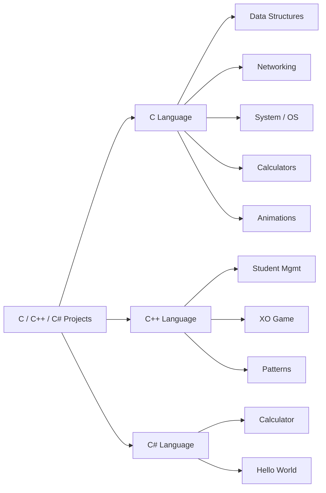
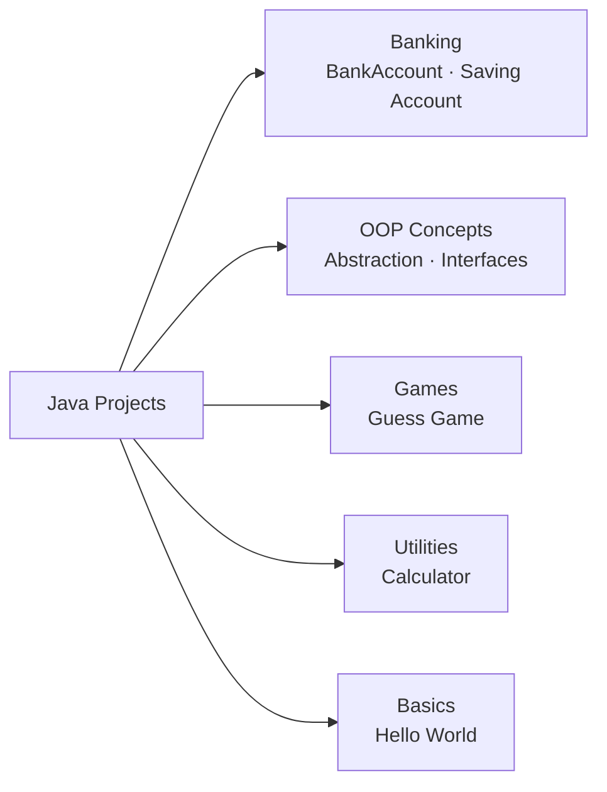
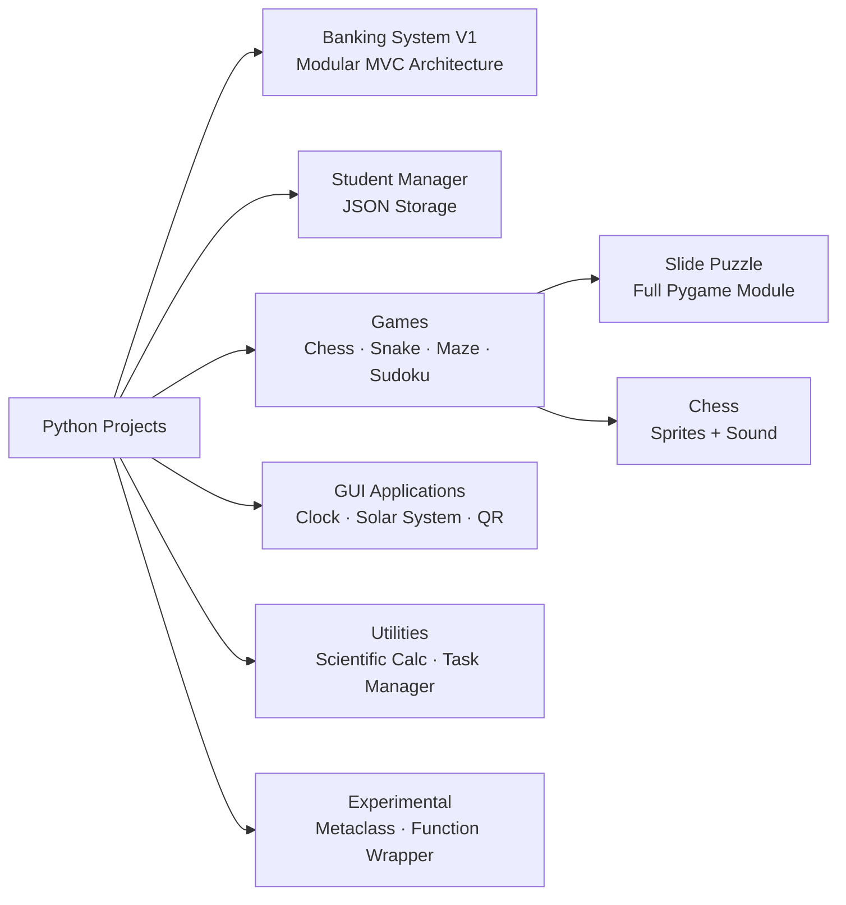
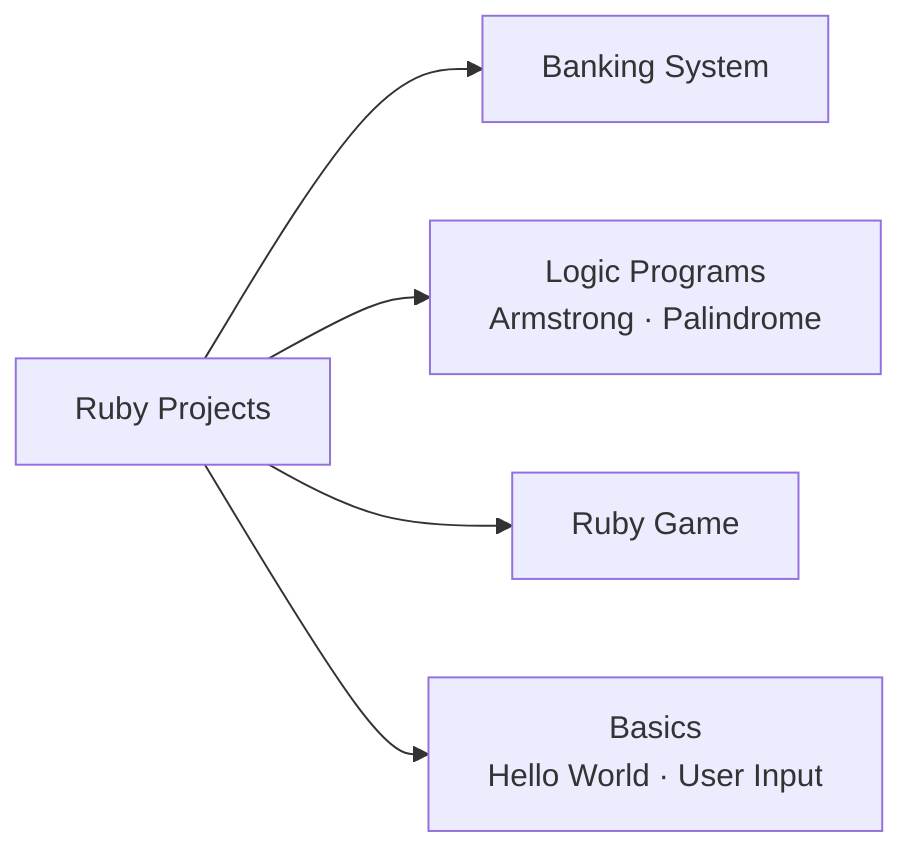
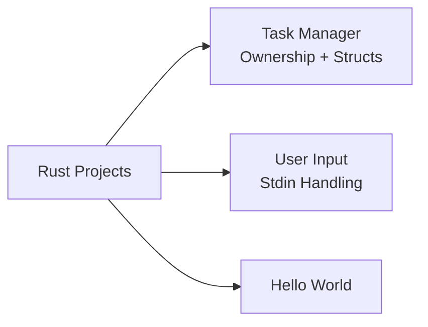

<div align="center">


<br/>

[](https://git.io/typing-svg)

<br/>

[](https://github.com/Manthanvinzuda007/Academic-Projects-2024-2028)
[](https://github.com/Manthanvinzuda007/Academic-Projects-2024-2028/stargazers)
[](https://github.com/Manthanvinzuda007/Academic-Projects-2024-2028/commits)
[](https://github.com/Manthanvinzuda007/Academic-Projects-2024-2028)
[](LICENSE)

</div>

---

## 🧭 Navigation

<div align="center">

| 📁 Structure | 💻 Languages | 🎮 Games | ⭐ Projects | 🛠️ Setup | 👤 Author |
|:---:|:---:|:---:|:---:|:---:|:---:|
| [Repository Structure](#-repository-structure) | [C / C++ / C#](#-c--c--c-projects) · [Python](#-python-projects) · [Java](#-java-projects) | [JavaScript Games](#-javascript-games-showcase) | [Featured Projects](#-featured-projects) | [Installation](#-installation-guide) | [About Me](#-about-the-author) |

</div>

<div align="center">

[Repository Structure](#-repository-structure) &nbsp;•&nbsp;
[C / C++ / C# Projects](#-c--c--c-projects) &nbsp;•&nbsp;
[Java Projects](#-java-projects) &nbsp;•&nbsp;
[Python Projects](#-python-projects) &nbsp;•&nbsp;
[JavaScript Games](#-javascript-games-showcase) &nbsp;•&nbsp;
[Ruby Projects](#-ruby-projects) &nbsp;•&nbsp;
[Rust Projects](#-rust-projects) &nbsp;•&nbsp;
[Featured Projects](#-featured-projects) &nbsp;•&nbsp;
[Installation](#-installation-guide) &nbsp;•&nbsp;
[Author](#-about-the-author)

</div>

---

## 🗂️ Repository Structure

> A top-level view of the entire repository, organized by language and project category.

```mermaid
flowchart TD
    ROOT[Academic Projects 2024-2028] --> CC[C / C++ / C# Projects]
    ROOT --> PY[Python Projects]
    ROOT --> JV[Java Projects]
    ROOT --> JS[Games Using Vanilla JS]
    ROOT --> RB[Ruby Projects]
    ROOT --> RS[Rust Projects]

    CC --> C[C Language Project]
    CC --> CPP[C++ Language Project]
    CC --> CS[C# Language Project]

    C --> C_DS[Data Structures\nAVL Tree · BST]
    C --> C_NET[Networking\nTCP Multi-Client Server]
    C --> C_SYS[System Programming\nFork · Thread Pool]
    C --> C_UTIL[Utilities\nCalculator · Matrix · Patterns]

    CPP --> CPP_STU[Student Management]
    CPP --> CPP_GAME[Games - XO]
    CPP --> CPP_PAT[Pattern Programs]

    CS --> CS_CALC[Calculator]
    CS --> CS_HW[Hello World]

    PY --> PY_BANK[Banking System V1\nmain · auth · banking · admin]
    PY --> PY_STU[Student Manager\nmain · model · database]
    PY --> PY_GAMES[Games\nChess · Snake · Sudoku · Maze]
    PY --> PY_GUI[GUI Apps\nClock · Solar System · QR Gen]
    PY --> PY_UTIL[Utilities\nScientific Calc · Task Manager]

    JV --> JV_BANK[Bank Account]
    JV --> JV_OOP[OOP - Abstraction]
    JV --> JV_GAME[Guess Game]
    JV --> JV_CALC[Calculator]

    JS --> JS_BOARD[Board Games\nChess · Checkers · Ludo · Backgammon]
    JS --> JS_PUZZLE[Puzzle Games\nSudoku · Minesweeper · Crossword]
    JS --> JS_ACTION[Action Games\nSnake · Tetris · Whack-A-Mole]
    JS --> JS_MAP[Generators\nMap · Random Map]
    JS --> JS_OTHER[More Games\nReversi · Dominoes · Connect4 · Battleship]

    RB --> RB_BANK[Banking System]
    RB --> RB_LOGIC[Armstrong Number · Palindrome]
    RB --> RB_GAME[Ruby Game]

    RS --> RS_TASK[Task Manager]
    RS --> RS_INPUT[User Input]
```



---

## 🔧 C / C++ / C# Projects

> Low-level systems, data structures, networking, and pattern programming — the foundation of computer science.

### Internal Structure



### 📄 C Language — File Index

| File | Category | Description |
|------|----------|-------------|
| `SELF-BALANCING AVL TREE.c` | 🌳 Data Structures | Self-balancing binary search tree with LL/RR/LR/RL rotations |
| `Binary Search Tree.c` | 🌳 Data Structures | BST with insert, delete, and traversal |
| `TCP Multi Client Server.c` | 🌐 Networking | Multi-client TCP server using POSIX sockets and threads |
| `Multithreaded Thread Pool.c` | ⚙️ System | Thread pool implementation using pthreads |
| `Fork .c` / `Fork 1–4.c` | ⚙️ System | Process creation and management using fork() |
| `Matrix .c` | 🔢 Math | Matrix operations and computations |
| `Full Calculator.c` | 🔢 Utility | Complete arithmetic calculator in C |
| `Calculate in C.c` | 🔢 Utility | Basic calculation program |
| `File Student MGT.c` | 🏫 Management | File-based student record management |
| `Latter Animation.c` | 🎨 Visual | Letter animation effects in terminal |
| `MANTHAN .c` / `MATHAN ANIMATION.c` | 🎨 Visual | Name animation in terminal |
| `Typing Ani.c` | 🎨 Visual | Typing animation effect |
| `Pattern 1–2.c` / `Pattern.c` | 📐 Patterns | Star and character pattern generators |
| `Hello world.c` | 👋 Basics | Hello World in C |

### 📄 C++ Language — File Index

| File | Category | Description |
|------|----------|-------------|
| `Student Management.cpp` | 🏫 Management | Full student management system using OOP |
| `Games/XO.cpp` | 🎮 Game | Console Tic-Tac-Toe game |
| `Pattern 1–7.cpp` | 📐 Patterns | Seven different pattern programs |
| `Calculate in C++.cpp` | 🔢 Utility | Calculator in C++ |
| `Hello world.cpp` | 👋 Basics | Hello World in C++ |

### 📄 C# Language — File Index

| File | Category | Description |
|------|----------|-------------|
| `Calculate in C#.cs` | 🔢 Utility | Calculator implemented in C# |
| `Hello World.cs` | 👋 Basics | Hello World in C# |

---

## ☕ Java Projects

> Object-oriented programming, banking simulations, and beginner-to-intermediate Java applications.

### Internal Structure



### 📄 Java — File Index

| File | Category | Description |
|------|----------|-------------|
| `BankAccount.java` | 🏦 Banking | Full bank account with deposit and withdrawal |
| `Saving Account.java` | 🏦 Banking | Savings account with interest logic |
| `Abstraction & Interfaces.java` | 🏛️ OOP | Demonstrates Java abstraction and interface patterns |
| `Gessgame.java` | 🎮 Game | Number guessing game |
| `Calculator.java` | 🔢 Utility | Console calculator in Java |
| `HelloWorld.java` | 👋 Basics | Hello World in Java |

---

## 🐍 Python Projects

> The most feature-rich section — banking systems, GUI apps, games, and experimental tools.

### Internal Structure



### 📄 Python — Major Project Files

| File / Folder | Category | Description |
|---------------|----------|-------------|
| `Banking System V1/` | 🏦 System | Modular banking — auth, admin, database, utils |
| `Student_Maneg/` | 🏫 System | JSON-backed student management system |
| `Games/Chess.py` | 🎮 Game | Full chess with Pygame, sprites, and sounds |
| `Games/Snake Game.py` | 🎮 Game | Classic snake with score and collision |
| `Games/Sudoku.py` | 🎮 Game | Sudoku solver and generator |
| `Games/Maze.py` | 🎮 Game | Recursive maze generation |
| `Games/Map Gen.py` | 🎮 Game | Procedural terrain map generator |
| `Games/Table Tennis.py` | 🎮 Game | Paddle game with Pygame |
| `Games/Connect 4.py` | 🎮 Game | Console Connect 4 |
| `Games/Slide Puzzle/` | 🎮 Game | Full Pygame slide puzzle with board, effects, sound |
| `Scientific Calculator.py` | 🔬 Utility | Scientific calculator with trig and logarithms |
| `Digital Clock .py` | 🕐 GUI | Animated digital clock |
| `Circle Watch.py` | 🕐 GUI | Circular animated clock |
| `Solar System .py` | 🌌 GUI | Animated solar system simulation |
| `QR Gen.py` | 📱 Utility | QR code generator |
| `Pythagoras Tree.py` | 🌿 Visual | Fractal Pythagoras tree renderer |
| `Task Mangar.py` | ✅ Utility | Terminal task manager |
| `StudyAlert.py` | ⏰ Utility | Study reminder and alert system |
| `The Mataclass.py` | 🧪 Experiment | Python metaclass demonstration |
| `The Function Wrapper Pattern.py` | 🧪 Experiment | Decorator and wrapper patterns |

---

## 🌐 JavaScript Games Showcase

> 20 browser-ready games built with **pure Vanilla JavaScript** — no frameworks, no dependencies. Open and play instantly.

### Games Map

```mermaid
flowchart TD
    JS[Games Using Vanilla JS] --> BOARD[Board Games]
    JS --> PUZZLE[Puzzle Games]
    JS --> ACTION[Action Games]
    JS --> STRATEGY[Strategy Games]
    JS --> GEN[Generators]

    BOARD --> B1[Chess]
    BOARD --> B2[Ludo]
    BOARD --> B3[Backgammon]
    BOARD --> B4[Checkers]
    BOARD --> B5[Monopoly]
    BOARD --> B6[Dominoes]

    PUZZLE --> P1[Sudoku]
    PUZZLE --> P2[Minesweeper]
    PUZZLE --> P3[Crossword]
    PUZZLE --> P4[XO Game]

    ACTION --> A1[Snake]
    ACTION --> A2[Tetris]
    ACTION --> A3[Whack-A-Mole]
    ACTION --> A4[Table Tennis]
    ACTION --> A5[Battleship]
    ACTION --> A6[Holi Game]

    STRATEGY --> S1[Reversi]
    STRATEGY --> S2[Connect 4]

    GEN --> G1[Map Generator]
    GEN --> G2[Random Map Gen]
```



### 🎮 Full Games Table

| # | 🎮 Game | 🔧 Stack | 📝 Description |
|---|---------|---------|---------------|
| 01 | ♟️ **Chess** | HTML · CSS · JS | Complete chess engine with full move validation and piece sprites |
| 02 | 🎯 **Tetris** | HTML · CSS · JS | Classic falling-block game with score and progressive levels |
| 03 | 🔢 **Sudoku** | HTML · CSS · JS | Puzzle generator and validator with multiple difficulties |
| 04 | 🐍 **Snake** | HTML · CSS · JS | Canvas-based snake with growing tail and collision detection |
| 05 | 🎲 **Ludo** | HTML · CSS · JS | Full Ludo board with dice rolling and token movement logic |
| 06 | 💣 **Minesweeper** | HTML · CSS · JS | Flag-based mine sweeper with safe first-click guarantee |
| 07 | 🎭 **Backgammon** | HTML · CSS · JS | Strategic board game with complete rule implementation |
| 08 | 🔃 **Reversi** | HTML · CSS · JS | Disc-flipping Othello with valid move highlighting |
| 09 | 🁣 **Dominoes** | HTML · CSS · JS | Tile-matching game with chain and scoring logic |
| 10 | 🔴 **Connect 4** | HTML · CSS · JS | Two-player vertical token drop with win detection |
| 11 | ✅ **Checkers** | HTML · CSS · JS | Diagonal jump game with king promotion |
| 12 | 🔤 **Crossword** | HTML · CSS · JS | Word grid puzzle with clue navigation |
| 13 | 🚢 **Battleship** | HTML · CSS · JS | Naval fleet placement and attack game |
| 14 | 🏓 **Table Tennis** | HTML · CSS · JS | Ping pong simulation with paddle controls |
| 15 | 🦔 **Whack-A-Mole** | HTML · CSS · JS | Timed reflex game with randomized mole appearances |
| 16 | ❌ **XO Game** | HTML · CSS · JS | Tic-Tac-Toe with animated win detection |
| 17 | 🗺️ **Map Generator** | HTML · CSS · JS | Procedural terrain map with seed-based rendering |
| 18 | 🌈 **Holi Game** | HTML · CSS · JS | Interactive colour-splash festive game |
| 19 | 🏘️ **Monopoly** | HTML · CSS · JS | Property trading board game |
| 20 | 🗺️ **Random Map Gen** | HTML · CSS · JS | Advanced dungeon and world generator |

---

## 💎 Ruby Projects

> Banking, algorithms, logic challenges, and introductory Ruby programs.

### Internal Structure



### 📄 Ruby — File Index

| File | Category | Description |
|------|----------|-------------|
| `Banking System.rb` | 🏦 System | Full banking system in Ruby |
| `Armstrong Number Logic.rb` | 🔢 Algorithm | Armstrong number checker |
| `Longest Palindromic Substring .rb` | 🔢 Algorithm | Dynamic programming palindrome solution |
| `Ruby game .rb` | 🎮 Game | Console game in Ruby |
| `User Input.rb` | 📥 Basics | User input and output handling |
| `Hello World.rb` | 👋 Basics | Hello World in Ruby |

---

## 🦀 Rust Projects

> First steps in Rust — memory safety, ownership, and systems programming foundations.

### Internal Structure



### 📄 Rust — File Index

| File | Category | Description |
|------|----------|-------------|
| `Task Maneger.rs` | ✅ Utility | CLI task manager demonstrating Rust ownership and structs |
| `User Input.rs` | 📥 Basics | Standard input and output in Rust |
| `Hello World.rs` | 👋 Basics | Hello World in Rust |

---

## ⭐ Featured Projects

<details>
<summary><b>🏦 Banking System — Python (Modular MVC)</b></summary>
<br/>

| Attribute | Details |
|-----------|---------|
| 📁 **Location** | `Python Projects/Banking System V1/` |
| 🐍 **Language** | Python |
| 📄 **Modules** | `main.py` · `auth.py` · `banking.py` · `admin.py` · `database.py` · `utils.py` |
| ✨ **Key Features** | Secure login and authentication · Admin dashboard · Deposits, withdrawals, transfers · File-based persistent database · Clean MVC modular architecture |

</details>

<details>
<summary><b>🌳 Self-Balancing AVL Tree — C</b></summary>
<br/>

| Attribute | Details |
|-----------|---------|
| 📁 **Location** | `C Language Project/SELF-BALANCING AVL TREE.c` |
| 💡 **Language** | C |
| ✨ **Key Features** | LL · RR · LR · RL rotations · Automatic height rebalancing · Insert, delete, search · In-order, pre-order traversal · O(log n) operations |

</details>

<details>
<summary><b>🌐 TCP Multi-Client Server — C</b></summary>
<br/>

| Attribute | Details |
|-----------|---------|
| 📁 **Location** | `C Language Project/TCP Multi Client Server.c` |
| 💡 **Language** | C |
| ✨ **Key Features** | POSIX socket programming · Concurrent multi-client connections · POSIX threads (pthreads) · Real-time bidirectional messaging |

</details>

<details>
<summary><b>♟️ Chess Engine — Python & JavaScript</b></summary>
<br/>

| Attribute | Details |
|-----------|---------|
| 📁 **Location** | `Python Projects/Games/Chess.py` and `Games Using Vanilla JS/Chess Index.html` |
| 💡 **Language** | Python (Pygame) + Vanilla JavaScript |
| ✨ **Key Features** | Full legal move generation · En passant and castling · Piece sprites from `/images/` · Sound effects (move, capture, game over) · Two-player local mode |

</details>

<details>
<summary><b>🏫 Student Management System — C++ & Python</b></summary>
<br/>

| Attribute | Details |
|-----------|---------|
| 📁 **Location** | `C++ Language Project/Student Management.cpp` and `Python Projects/Student_Maneg/` |
| 💡 **Language** | C++ / Python |
| ✨ **Key Features** | Add, delete, update, search students · JSON-backed persistent storage · OOP design patterns · Model-View separation |

</details>

<details>
<summary><b>🔬 Scientific Calculator — Python</b></summary>
<br/>

| Attribute | Details |
|-----------|---------|
| 📁 **Location** | `Python Projects/Scientific Calculator.py` |
| 💡 **Language** | Python |
| ✨ **Key Features** | Trigonometry (sin, cos, tan) · Logarithms · Square root · Power · GUI interface |

</details>

<details>
<summary><b>🗺️ Random Map Generator — Python & JavaScript</b></summary>
<br/>

| Attribute | Details |
|-----------|---------|
| 📁 **Location** | `Python Projects/Games/Map Gen.py` and `Games Using Vanilla JS/Random Map Gen Index.html` |
| 💡 **Language** | Python + JavaScript |
| ✨ **Key Features** | Procedural terrain generation · Randomized seeding · Biome colour mapping · Canvas rendering |

</details>

---

## 📊 Languages Used

### Distribution Chart

```
Python       ███████████░░░░░░░░░  35%   🐍
JavaScript   ███████░░░░░░░░░░░░░  20%   🌐
C / C++      ██████░░░░░░░░░░░░░░  18%   ⚙️
Java         ████░░░░░░░░░░░░░░░░  10%   ☕
Ruby         ███░░░░░░░░░░░░░░░░░   6%   💎
Rust         ██░░░░░░░░░░░░░░░░░░   5%   🦀
C#           ██░░░░░░░░░░░░░░░░░░   4%   🔷
HTML / CSS   █░░░░░░░░░░░░░░░░░░░   2%   🌍
```

### Language Badges

<div align="center">


</div>

---

## ⚙️ Installation Guide

### 🐍 Python Projects

```bash
# Clone the repository
git clone https://github.com/Manthanvinzuda007/Academic-Projects-2024-2028.git
cd Academic-Projects-2024-2028

# Install dependencies for GUI and game projects
pip install pygame

# Run examples
python "Python Projects/Banking System V1/main.py"
python "Python Projects/Games/Chess.py"
python "Python Projects/Games/Snake Game.py"
python "Python Projects/Student_Maneg/main.py"
python "Python Projects/Scientific Calculator.py"
python "Python Projects/Digital Clock .py"
```

### ⚙️ C Programs

```bash
cd "C C++ C# Projects/C Language Project"

# Standard compilation
gcc program.c -o program && ./program

# With threading (pthreads)
gcc "Multithreaded Thread Pool.c" -o threadpool -lpthread && ./threadpool

# Networking server
gcc "TCP Multi Client Server.c" -o server -lpthread && ./server

# Data structures
gcc "SELF-BALANCING AVL TREE.c" -o avl && ./avl
gcc "Binary Search Tree.c" -o bst && ./bst
```

### 🔧 C++ Programs

```bash
cd "C C++ C# Projects/C++ Language Project"

g++ program.cpp -o program && ./program

# Student Management System
g++ "Student Management.cpp" -o student_mgr && ./student_mgr

# XO Game
g++ "Games/XO.cpp" -o xo && ./xo
```

### ☕ Java Programs

```bash
cd "Java Projects"

# Compile and run
javac BankAccount.java && java BankAccount
javac Calculator.java && java Calculator
javac Gessgame.java && java Gessgame
javac "Abstraction & Interfaces.java" && java "Abstraction & Interfaces"
```

### 🌐 JavaScript Browser Games

```bash
# No build tools required

# Option 1: Python HTTP server (recommended)
cd "Games Using Vanilla JS"
python -m http.server 8080
# Open: http://localhost:8080

# Option 2: Open directly in browser
open "Chess Index.html"
open "Tetris Index.html"
open "Sudoku Index.html"

# Option 3: VS Code Live Server
# Right-click any .html file -> Open with Live Server
```

### 💎 Ruby Programs

```bash
cd "Ruby Projects"
ruby "Banking System.rb"
ruby "Armstrong Number  Logic.rb"
ruby "Hello World.rb"
```

### 🦀 Rust Programs

```bash
cd "Rust Projects"

# Compile and run
rustc "Task Maneger.rs" -o task_manager && ./task_manager
rustc "User Input.rs" -o user_input && ./user_input
```

---

## 🎓 Programming Concepts Covered

| Concept | Description | Languages |
|---------|-------------|-----------|
| 🏛️ **Object Oriented Programming** | Encapsulation, Inheritance, Polymorphism, Abstraction | Python · Java · C++ · C# · Ruby |
| 🔁 **Algorithms** | Sorting, Searching, Recursion, Tree Traversal | C · C++ · Python · Ruby |
| 🌳 **Data Structures** | AVL Tree, BST, Stack, Queue, Matrix | C · Python · Java |
| 🌐 **Networking** | TCP Sockets, Multi-Client Server, Socket APIs | C |
| ⚡ **Multithreading** | POSIX Threads, Thread Pool, Fork / Processes | C |
| 🎮 **Game Development** | Canvas API, Pygame, Collision, AI Logic | Python · JavaScript |
| 💾 **File Handling** | JSON Storage, Text Files, File-Backed Databases | Python · C · C++ · Ruby |
| 🖥️ **GUI Programming** | Pygame, Tkinter, Canvas API, CSS Animations | Python · JavaScript |

---

## 📈 Repository Stats

<div align="center">

| 📊 Metric | 🔢 Count |
|-----------|---------|
| 🗂️ **Total Projects** | 55+ |
| 🌐 **Languages** | 8 |
| 🎮 **Games Built** | 25+ |
| ⚙️ **System Programs** | 10+ |
| 📄 **Source Files** | 150+ |
| 📅 **Active Since** | 2024 |

[](https://github.com/Manthanvinzuda007)

</div>

---

## 🤝 Contributing

This is a **personal academic portfolio**. Suggestions, improvements, and collaborations are welcome!

```bash
# 1. Fork this repository
# 2. Create your feature branch
git checkout -b feature/your-idea

# 3. Commit your work
git commit -m "Add: brief description of change"

# 4. Push your branch
git push origin feature/your-idea

# 5. Open a Pull Request
```

> Please maintain the existing folder structure and naming conventions.

---

## 👤 About the Author

<div align="center">

```
╔══════════════════════════════════════════════════════════════════╗
║                                                                  ║
║                  M . S . V I N Z U D A                          ║
║              ───────────────────────────                         ║
║                                                                  ║
║   A passionate developer exploring the full spectrum of          ║
║   programming — from low-level systems in C and Rust to          ║
║   browser games in JavaScript, OOP in Java and Python,           ║
║   and algorithms that push the boundaries of logic.              ║
║                                                                  ║
║   Every commit is a step forward. Every project is a lesson.     ║
║                                                                  ║
║   🐍 Python    ⚙️  C / C++    🌐 JavaScript    ☕ Java            ║
║   💎 Ruby      🦀  Rust       🔷 C#            🖥️  Systems        ║
║                                                                  ║
║   📅 Academic Journey: 2024 → 2028                               ║
║                                                                  ║
╚══════════════════════════════════════════════════════════════════╝
```

[](https://github.com/Manthanvinzuda007)
[](https://github.com/Manthanvinzuda007)

</div>

---

<div align="center">

### 💡 A Developer's Creed

<br/>

*"Code is not just instructions for machines —*
<br/>
*it is creativity for the mind,*
<br/>
*a language that bridges imagination and reality."*

<br/>

**— M.S.Vinzuda · Academic Projects 2024–2028**

<br/>


</div>
