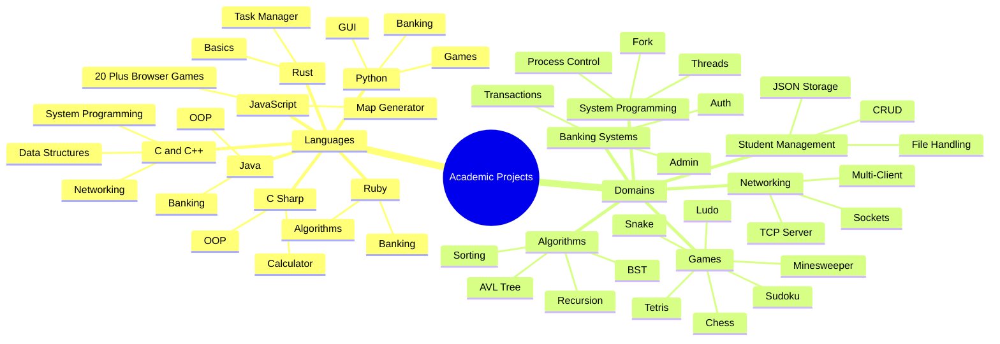
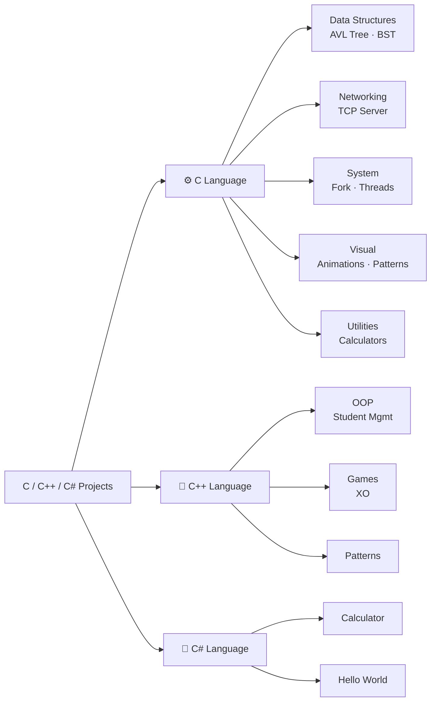
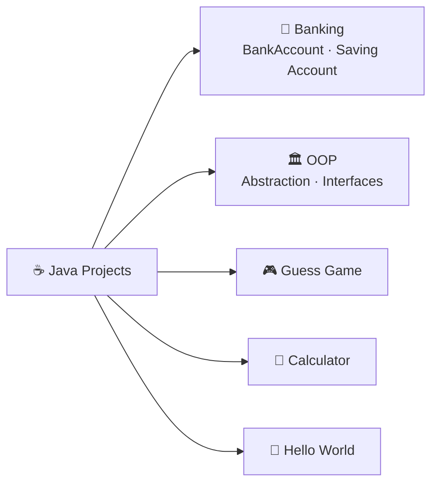
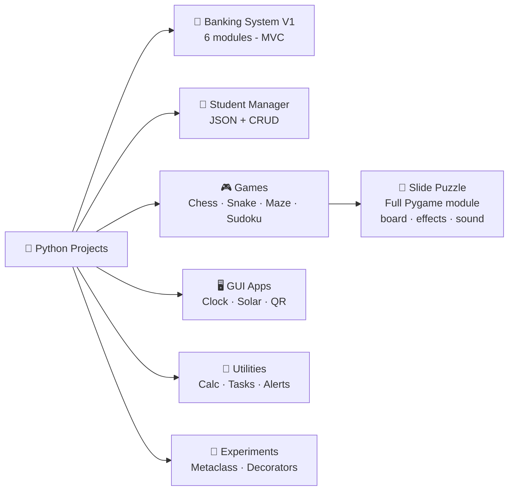
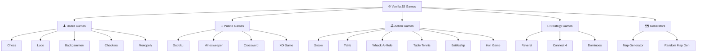
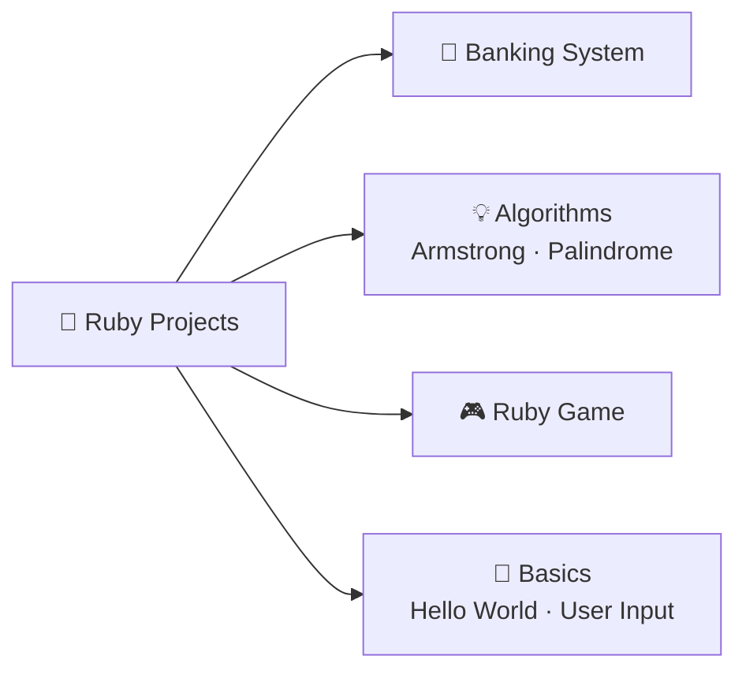
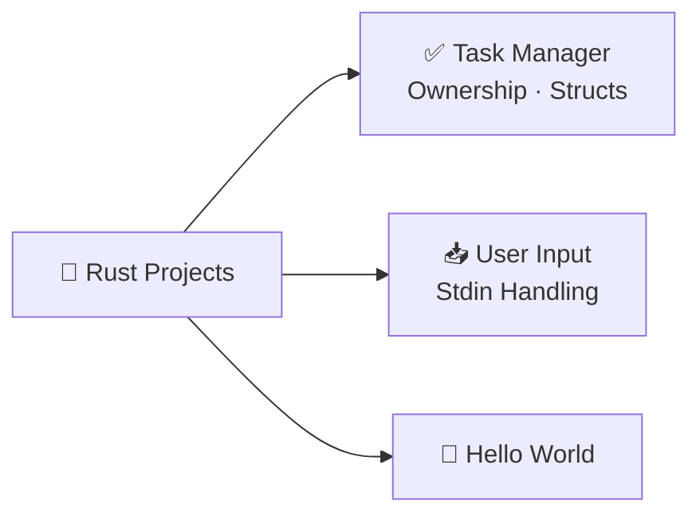

<div align="center">


<br/>

[](https://git.io/typing-svg)

<br/>

[](https://github.com/Manthanvinzuda007/Academic-Projects-2024-2028)
[](https://github.com/Manthanvinzuda007/Academic-Projects-2024-2028/stargazers)
[](https://github.com/Manthanvinzuda007/Academic-Projects-2024-2028/forks)
[](https://github.com/Manthanvinzuda007/Academic-Projects-2024-2028/commits)
[](https://github.com/Manthanvinzuda007/Academic-Projects-2024-2028)

</div>

---

## 📊 GitHub Language Statistics

<div align="center">

[](https://github.com/Manthanvinzuda007/Academic-Projects-2024-2028)

[](https://github.com/Manthanvinzuda007)

[](https://github.com/Manthanvinzuda007)

</div>

---

## 🧭 Navigation

<div align="center">

[📋 Repository Map](#-repository-map) &nbsp;|&nbsp;
[📁 Folder Explorer](#-folder-explorer) &nbsp;|&nbsp;
[🔧 C / C++ / C#](#-c--c--c-projects) &nbsp;|&nbsp;
[☕ Java](#-java-projects) &nbsp;|&nbsp;
[🐍 Python](#-python-projects) &nbsp;|&nbsp;
[🌐 JavaScript Games](#-javascript-games-showcase) &nbsp;|&nbsp;
[💎 Ruby](#-ruby-projects) &nbsp;|&nbsp;
[🦀 Rust](#-rust-projects) &nbsp;|&nbsp;
[⭐ Featured](#-featured-projects) &nbsp;|&nbsp;
[⚙️ Installation](#%EF%B8%8F-installation-guide) &nbsp;|&nbsp;
[👤 Author](#-about-the-author)

</div>

---

## 📋 Repository Map

### 🧠 Project Ecosystem — Mindmap



---

## 📁 Folder Explorer

> Click any folder to jump directly to it on GitHub.

<div align="center">

| 📂 Folder | 🔗 Quick Link | 🌐 Languages | 📊 Projects |
|-----------|-------------|-------------|------------|
| 🔧 **C / C++ / C# Projects** | [Browse Folder →](https://github.com/Manthanvinzuda007/Academic-Projects-2024-2028/tree/main/C%20C%2B%2B%20C%23%20Projects) | C · C++ · C# | Data Structures · Networking · System Programming |
| ☕ **Java Projects** | [Browse Folder →](https://github.com/Manthanvinzuda007/Academic-Projects-2024-2028/tree/main/Java%20Projects) | Java | OOP · Banking · Games |
| 🐍 **Python Projects** | [Browse Folder →](https://github.com/Manthanvinzuda007/Academic-Projects-2024-2028/tree/main/Python%20Projects) | Python | Banking · Games · GUI · Utilities |
| 🌐 **JavaScript Games** | [Browse Folder →](https://github.com/Manthanvinzuda007/Academic-Projects-2024-2028/tree/main/Games%20Using%20Vanilla%20JS) | HTML · CSS · JS | 20+ Browser Games |
| 💎 **Ruby Projects** | [Browse Folder →](https://github.com/Manthanvinzuda007/Academic-Projects-2024-2028/tree/main/Ruby%20Projects) | Ruby | Banking · Algorithms |
| 🦀 **Rust Projects** | [Browse Folder →](https://github.com/Manthanvinzuda007/Academic-Projects-2024-2028/tree/main/Rust%20Projects) | Rust | Task Manager · Basics |

</div>

---

## 🗂️ Full Repository Structure

```mermaid
flowchart TD
    ROOT["🎓 Academic Projects 2024–2028"] --> CC["🔧 C / C++ / C# Projects"]
    ROOT --> PY["🐍 Python Projects"]
    ROOT --> JV["☕ Java Projects"]
    ROOT --> JS["🌐 Games Using Vanilla JS"]
    ROOT --> RB["💎 Ruby Projects"]
    ROOT --> RS["🦀 Rust Projects"]

    CC --> C_L["📁 C Language Project"]
    CC --> CPP_L["📁 C++ Language Project"]
    CC --> CS_L["📁 C# Language Project"]

    C_L --> C1["🌳 AVL Tree · BST"]
    C_L --> C2["🌐 TCP Multi-Client Server"]
    C_L --> C3["⚙️ Fork · Thread Pool"]
    C_L --> C4["📐 Matrix · Patterns · Animations"]
    C_L --> C5["🔢 Calculators"]

    CPP_L --> CPP1["🏫 Student Management"]
    CPP_L --> CPP2["🎮 XO Game"]
    CPP_L --> CPP3["📐 Pattern Programs 1–7"]

    CS_L --> CS1["🔢 Calculator"]
    CS_L --> CS2["👋 Hello World"]

    PY --> PY_B["🏦 Banking System V1\nmain · auth · banking · admin · db"]
    PY --> PY_S["🏫 Student Manager\nmain · model · database"]
    PY --> PY_G["🎮 Games\nChess · Snake · Maze · Sudoku · Slide Puzzle"]
    PY --> PY_UI["🖥️ GUI Apps\nClock · Solar System · QR Gen"]
    PY --> PY_U["🔬 Utilities\nScientific Calc · Task Manager · Study Alert"]

    JV --> JV1["🏦 BankAccount · Saving Account"]
    JV --> JV2["🏛️ Abstraction · Interfaces"]
    JV --> JV3["🎮 Guess Game"]
    JV --> JV4["🔢 Calculator"]

    JS --> JS_B["♟️ Board\nChess · Ludo · Backgammon · Checkers"]
    JS --> JS_P["🧩 Puzzle\nSudoku · Minesweeper · Crossword · XO"]
    JS --> JS_A["🕹️ Action\nSnake · Tetris · Whack-A-Mole · Table Tennis"]
    JS --> JS_S["🧠 Strategy\nReversi · Connect 4 · Battleship · Dominoes"]
    JS --> JS_G["🗺️ Generators\nMap · Random Map · Holi Game"]
    JS --> JS_O["🏘️ Other\nMonopoly"]

    RB --> RB1["🏦 Banking System"]
    RB --> RB2["💡 Armstrong · Palindrome"]
    RB --> RB3["🎮 Ruby Game"]

    RS --> RS1["✅ Task Manager"]
    RS --> RS2["📥 User Input"]
```



---

## 🔧 C / C++ / C# Projects

> The core of systems programming — data structures, networking, multithreading, process control, and pattern algorithms.



### 📄 C Language — File Index

| File | Category | Description |
|------|----------|-------------|
| [`SELF-BALANCING AVL TREE.c`](https://github.com/Manthanvinzuda007/Academic-Projects-2024-2028/blob/main/C%20C%2B%2B%20C%23%20Projects/C%20Language%20Project/SELF-BALANCING%20AVL%20TREE.c) | 🌳 Data Structures | Self-balancing BST with LL/RR/LR/RL rotations |
| [`Binary Search Tree.c`](https://github.com/Manthanvinzuda007/Academic-Projects-2024-2028/blob/main/C%20C%2B%2B%20C%23%20Projects/C%20Language%20Project/Binary%20Search%20Tree.c) | 🌳 Data Structures | BST with insert, delete, traversal |
| [`TCP Multi Client Server.c`](https://github.com/Manthanvinzuda007/Academic-Projects-2024-2028/blob/main/C%20C%2B%2B%20C%23%20Projects/C%20Language%20Project/TCP%20Multi%20Client%20Server.c) | 🌐 Networking | Multi-client TCP server using POSIX sockets |
| [`Multithreaded Thread Pool.c`](https://github.com/Manthanvinzuda007/Academic-Projects-2024-2028/blob/main/C%20C%2B%2B%20C%23%20Projects/C%20Language%20Project/Multithreaded%20Thread%20Pool.c) | ⚙️ System | Thread pool with pthreads |
| `Fork .c` · `Fork 1–4.c` | ⚙️ System | Process creation with fork() — 5 variations |
| [`Matrix .c`](https://github.com/Manthanvinzuda007/Academic-Projects-2024-2028/blob/main/C%20C%2B%2B%20C%23%20Projects/C%20Language%20Project/Matrix%20.c) | 🔢 Math | Matrix operations and computations |
| [`Full Calculator.c`](https://github.com/Manthanvinzuda007/Academic-Projects-2024-2028/blob/main/C%20C%2B%2B%20C%23%20Projects/C%20Language%20Project/Full%20Calculator.c) | 🔢 Utility | Complete arithmetic calculator |
| [`File Student MGT.c`](https://github.com/Manthanvinzuda007/Academic-Projects-2024-2028/blob/main/C%20C%2B%2B%20C%23%20Projects/C%20Language%20Project/File%20Student%20MGT.c) | 🏫 Management | File-based student record management |
| `Latter Animation.c` · `Typing Ani.c` | 🎨 Visual | Terminal letter and typing animations |
| `MANTHAN .c` · `MATHAN ANIMATION.c` | 🎨 Visual | Personalised name animations in terminal |
| `Pattern 1–2.c` · `Pattern.c` | 📐 Patterns | Star and character pattern generators |

### 📄 C++ Language — File Index

| File | Category | Description |
|------|----------|-------------|
| [`Student Management.cpp`](https://github.com/Manthanvinzuda007/Academic-Projects-2024-2028/blob/main/C%20C%2B%2B%20C%23%20Projects/C%2B%2B%20Language%20Project/Student%20Management.cpp) | 🏫 Management | Full OOP student system |
| [`Games/XO.cpp`](https://github.com/Manthanvinzuda007/Academic-Projects-2024-2028/blob/main/C%20C%2B%2B%20C%23%20Projects/C%2B%2B%20Language%20Project/Games/XO.cpp) | 🎮 Game | Console Tic-Tac-Toe |
| `Pattern 1–7.cpp` | 📐 Patterns | Seven pattern programs |
| `Calculate in C++.cpp` | 🔢 Utility | C++ calculator |

### 📄 C# Language — File Index

| File | Category | Description |
|------|----------|-------------|
| `Calculate in C#.cs` | 🔢 Utility | Calculator in C# |
| `Hello World.cs` | 👋 Basics | Hello World |

---

## ☕ Java Projects

> Object-oriented programming, banking simulations, and foundational Java development.



### 📄 Java — File Index

| File | Category | Description |
|------|----------|-------------|
| [`BankAccount.java`](https://github.com/Manthanvinzuda007/Academic-Projects-2024-2028/blob/main/Java%20Projects/BankAccount.java) | 🏦 Banking | Full bank account with deposit and withdrawal |
| [`Saving Account.java`](https://github.com/Manthanvinzuda007/Academic-Projects-2024-2028/blob/main/Java%20Projects/Saving%20Account.java) | 🏦 Banking | Savings account with interest logic |
| [`Abstraction & Interfaces.java`](https://github.com/Manthanvinzuda007/Academic-Projects-2024-2028/blob/main/Java%20Projects/Abstraction%20%26%20Interfaces.java) | 🏛️ OOP | Java abstraction and interface demonstration |
| [`Gessgame.java`](https://github.com/Manthanvinzuda007/Academic-Projects-2024-2028/blob/main/Java%20Projects/Gessgame.java) | 🎮 Game | Number guessing game |
| [`Calculator.java`](https://github.com/Manthanvinzuda007/Academic-Projects-2024-2028/blob/main/Java%20Projects/Calculator.java) | 🔢 Utility | Console calculator |
| [`HelloWorld.java`](https://github.com/Manthanvinzuda007/Academic-Projects-2024-2028/blob/main/Java%20Projects/HelloWorld.java) | 👋 Basics | Hello World |

---

## 🐍 Python Projects

> The largest section — banking systems, GUI applications, games, and experimental programming tools.



### 📄 Python — File Index

| File / Folder | Category | Description |
|---------------|----------|-------------|
| [`Banking System V1/`](https://github.com/Manthanvinzuda007/Academic-Projects-2024-2028/tree/main/Python%20Projects/Banking%20System%20V1) | 🏦 System | `main` · `auth` · `banking` · `admin` · `database` · `utils` |
| [`Student_Maneg/`](https://github.com/Manthanvinzuda007/Academic-Projects-2024-2028/tree/main/Python%20Projects/Student_Maneg) | 🏫 System | `main` · `model` · `database` · JSON storage |
| [`Games/Chess.py`](https://github.com/Manthanvinzuda007/Academic-Projects-2024-2028/blob/main/Python%20Projects/Games/Chess.py) | 🎮 Game | Full chess with Pygame, sprites, sounds |
| [`Games/Snake Game.py`](https://github.com/Manthanvinzuda007/Academic-Projects-2024-2028/blob/main/Python%20Projects/Games/Snake%20Game.py) | 🎮 Game | Classic snake with collision and scoring |
| [`Games/Sudoku.py`](https://github.com/Manthanvinzuda007/Academic-Projects-2024-2028/blob/main/Python%20Projects/Games/Sudoku.py) | 🎮 Game | Sudoku solver and generator |
| [`Games/Maze.py`](https://github.com/Manthanvinzuda007/Academic-Projects-2024-2028/blob/main/Python%20Projects/Games/Maze.py) | 🎮 Game | Recursive maze generation |
| [`Games/Map Gen.py`](https://github.com/Manthanvinzuda007/Academic-Projects-2024-2028/blob/main/Python%20Projects/Games/Map%20Gen.py) | 🎮 Game | Procedural terrain map |
| [`Games/Slide Puzzle/`](https://github.com/Manthanvinzuda007/Academic-Projects-2024-2028/tree/main/Python%20Projects/Games/Slide%20Puzzle) | 🧩 Game | Full Pygame puzzle — `board` · `effects` · `ui` · `sound_manager` |
| [`Games/Table Tennis.py`](https://github.com/Manthanvinzuda007/Academic-Projects-2024-2028/blob/main/Python%20Projects/Games/Table%20Tennis.py) | 🎮 Game | Pygame table tennis |
| [`Games/Connect 4.py`](https://github.com/Manthanvinzuda007/Academic-Projects-2024-2028/blob/main/Python%20Projects/Games/Connect%204.py) | 🎮 Game | Console Connect 4 |
| [`Scientific Calculator.py`](https://github.com/Manthanvinzuda007/Academic-Projects-2024-2028/blob/main/Python%20Projects/Scientific%20Calculator.py) | 🔬 Utility | Trig, log, sqrt, power operations |
| [`Digital Clock .py`](https://github.com/Manthanvinzuda007/Academic-Projects-2024-2028/blob/main/Python%20Projects/Digital%20Clock%20.py) | 🕐 GUI | Animated digital clock |
| [`Solar System .py`](https://github.com/Manthanvinzuda007/Academic-Projects-2024-2028/blob/main/Python%20Projects/Solar%20System%20.py) | 🌌 GUI | Animated solar system simulation |
| [`QR Gen.py`](https://github.com/Manthanvinzuda007/Academic-Projects-2024-2028/blob/main/Python%20Projects/QR%20Gen.py) | 📱 Utility | QR code generator |
| [`Pythagoras Tree.py`](https://github.com/Manthanvinzuda007/Academic-Projects-2024-2028/blob/main/Python%20Projects/Pythagoras%20Tree.py) | 🌿 Visual | Fractal Pythagoras tree |
| [`Task Mangar.py`](https://github.com/Manthanvinzuda007/Academic-Projects-2024-2028/blob/main/Python%20Projects/Task%20Mangar.py) | ✅ Utility | Terminal task manager |
| [`StudyAlert.py`](https://github.com/Manthanvinzuda007/Academic-Projects-2024-2028/blob/main/Python%20Projects/StudyAlert.py) | ⏰ Utility | Study session reminder |
| [`The Mataclass.py`](https://github.com/Manthanvinzuda007/Academic-Projects-2024-2028/blob/main/Python%20Projects/The%20Mataclass.py) | 🧪 Experiment | Python metaclass patterns |
| [`The Function Wrapper Pattern.py`](https://github.com/Manthanvinzuda007/Academic-Projects-2024-2028/blob/main/Python%20Projects/The%20Function%20Wrapper%20Pattern.py) | 🧪 Experiment | Decorators and wrapper patterns |

---

## 🌐 JavaScript Games Showcase

> **20 browser-ready games** built entirely with **Vanilla HTML · CSS · JavaScript** — no frameworks, no dependencies.



| # | 🎮 Game | 🔧 Stack | 📝 Description |
|---|---------|---------|---------------|
| 01 | ♟️ **Chess** | HTML · CSS · JS | Full chess engine — move validation, en passant, castling, sprites |
| 02 | 🎯 **Tetris** | HTML · CSS · JS | Block-falling game with progressive levels and score |
| 03 | 🔢 **Sudoku** | HTML · CSS · JS | Puzzle generator and validator with difficulty modes |
| 04 | 🐍 **Snake** | HTML · CSS · JS | Canvas snake with growing tail and collision |
| 05 | 🎲 **Ludo** | HTML · CSS · JS | Full Ludo with dice rolling and token logic |
| 06 | 💣 **Minesweeper** | HTML · CSS · JS | Flag-based sweeper with safe first-click |
| 07 | 🎭 **Backgammon** | HTML · CSS · JS | Complete rule implementation for Backgammon |
| 08 | 🔃 **Reversi** | HTML · CSS · JS | Othello with valid-move highlighting |
| 09 | 🁣 **Dominoes** | HTML · CSS · JS | Tile-matching with chain and scoring |
| 10 | 🔴 **Connect 4** | HTML · CSS · JS | Two-player drop game with win detection |
| 11 | ✅ **Checkers** | HTML · CSS · JS | Diagonal jump game with king promotion |
| 12 | 🔤 **Crossword** | HTML · CSS · JS | Word grid puzzle with clue navigation |
| 13 | 🚢 **Battleship** | HTML · CSS · JS | Naval fleet attack game |
| 14 | 🏓 **Table Tennis** | HTML · CSS · JS | Ping pong with paddle controls |
| 15 | 🦔 **Whack-A-Mole** | HTML · CSS · JS | Timed reflex game with randomised moles |
| 16 | ❌ **XO Game** | HTML · CSS · JS | Tic-Tac-Toe with animated win detection |
| 17 | 🗺️ **Map Generator** | HTML · CSS · JS | Procedural terrain with seed-based rendering |
| 18 | 🌈 **Holi Game** | HTML · CSS · JS | Festive colour-splash interactive game |
| 19 | 🏘️ **Monopoly** | HTML · CSS · JS | Property trading board game |
| 20 | 🗺️ **Random Map Gen** | HTML · CSS · JS | Advanced dungeon and world generator |

---

## 💎 Ruby Projects

> Banking systems, algorithmic challenges, and introductory Ruby programming.



### 📄 Ruby — File Index

| File | Category | Description |
|------|----------|-------------|
| [`Banking System.rb`](https://github.com/Manthanvinzuda007/Academic-Projects-2024-2028/blob/main/Ruby%20Projects/Banking%20System.rb) | 🏦 System | Full banking system in Ruby |
| [`Armstrong Number  Logic.rb`](https://github.com/Manthanvinzuda007/Academic-Projects-2024-2028/blob/main/Ruby%20Projects/Armstrong%20Number%20%20Logic.rb) | 💡 Algorithm | Armstrong number checker |
| [`Longest Palindromic Substring .rb`](https://github.com/Manthanvinzuda007/Academic-Projects-2024-2028/blob/main/Ruby%20Projects/Longest%20Palindromic%20Substring%20.rb) | 💡 Algorithm | Dynamic programming palindrome solution |
| [`Ruby game .rb`](https://github.com/Manthanvinzuda007/Academic-Projects-2024-2028/blob/main/Ruby%20Projects/Ruby%20game%20.rb) | 🎮 Game | Console game in Ruby |
| [`User Input.rb`](https://github.com/Manthanvinzuda007/Academic-Projects-2024-2028/blob/main/Ruby%20Projects/User%20Input.rb) | 📥 Basics | Input and output handling |
| [`Hello World.rb`](https://github.com/Manthanvinzuda007/Academic-Projects-2024-2028/blob/main/Ruby%20Projects/Hello%20World.rb) | 👋 Basics | Hello World |

---

## 🦀 Rust Projects

> Memory safety, ownership concepts, and Rust fundamentals.



### 📄 Rust — File Index

| File | Category | Description |
|------|----------|-------------|
| [`Task Maneger.rs`](https://github.com/Manthanvinzuda007/Academic-Projects-2024-2028/blob/main/Rust%20Projects/Task%20Maneger.rs) | ✅ Utility | CLI task manager using Rust ownership and structs |
| [`User Input.rs`](https://github.com/Manthanvinzuda007/Academic-Projects-2024-2028/blob/main/Rust%20Projects/User%20Input.rs) | 📥 Basics | Standard input/output in Rust |
| [`Hello World.rs`](https://github.com/Manthanvinzuda007/Academic-Projects-2024-2028/blob/main/Rust%20Projects/Hello%20World.rs) | 👋 Basics | Hello World in Rust |

---

## ⭐ Featured Projects

<details>
<summary><b>🏦 Banking System V1 — Python (Full MVC Architecture)</b></summary>
<br/>

| Attribute | Details |
|-----------|---------|
| 📁 **Location** | [`Python Projects/Banking System V1/`](https://github.com/Manthanvinzuda007/Academic-Projects-2024-2028/tree/main/Python%20Projects/Banking%20System%20V1) |
| 🐍 **Language** | Python |
| 📄 **Files** | `main.py` · `auth.py` · `banking.py` · `admin.py` · `database.py` · `utils.py` |
| ✨ **Key Features** | Secure login and auth system · Admin control panel · Deposits, withdrawals, balance check · File-backed persistent database · Clean MVC modular architecture |

</details>

<details>
<summary><b>🌳 Self-Balancing AVL Tree — C</b></summary>
<br/>

| Attribute | Details |
|-----------|---------|
| 📁 **Location** | [`C Language Project/SELF-BALANCING AVL TREE.c`](https://github.com/Manthanvinzuda007/Academic-Projects-2024-2028/blob/main/C%20C%2B%2B%20C%23%20Projects/C%20Language%20Project/SELF-BALANCING%20AVL%20TREE.c) |
| 💡 **Language** | C |
| ✨ **Key Features** | LL · RR · LR · RL rotations · Auto height rebalancing · O(log n) insert/delete/search · Full traversal methods |

</details>

<details>
<summary><b>🌐 TCP Multi-Client Server — C</b></summary>
<br/>

| Attribute | Details |
|-----------|---------|
| 📁 **Location** | [`C Language Project/TCP Multi Client Server.c`](https://github.com/Manthanvinzuda007/Academic-Projects-2024-2028/blob/main/C%20C%2B%2B%20C%23%20Projects/C%20Language%20Project/TCP%20Multi%20Client%20Server.c) |
| 💡 **Language** | C |
| ✨ **Key Features** | POSIX socket programming · Concurrent multi-client support · pthreads for parallel handling · Real-time bidirectional messaging |

</details>

<details>
<summary><b>♟️ Chess — Python & JavaScript (Dual Implementation)</b></summary>
<br/>

| Attribute | Details |
|-----------|---------|
| 📁 **Python** | [`Python Projects/Games/Chess.py`](https://github.com/Manthanvinzuda007/Academic-Projects-2024-2028/blob/main/Python%20Projects/Games/Chess.py) |
| 📁 **JavaScript** | [`Games Using Vanilla JS/Chess Index.html`](https://github.com/Manthanvinzuda007/Academic-Projects-2024-2028/blob/main/Games%20Using%20Vanilla%20JS/Chess%20Index.html) |
| 💡 **Languages** | Python (Pygame) + Vanilla JavaScript |
| ✨ **Key Features** | Full legal move generation · En passant and castling · Piece sprites · Sound effects (move, capture, game over) · Two-player local mode |

</details>

<details>
<summary><b>🏫 Student Management System — C++ & Python</b></summary>
<br/>

| Attribute | Details |
|-----------|---------|
| 📁 **C++** | [`C++ Language Project/Student Management.cpp`](https://github.com/Manthanvinzuda007/Academic-Projects-2024-2028/blob/main/C%20C%2B%2B%20C%23%20Projects/C%2B%2B%20Language%20Project/Student%20Management.cpp) |
| 📁 **Python** | [`Python Projects/Student_Maneg/`](https://github.com/Manthanvinzuda007/Academic-Projects-2024-2028/tree/main/Python%20Projects/Student_Maneg) |
| 💡 **Languages** | C++ / Python |
| ✨ **Key Features** | Add · Delete · Update · Search · JSON-backed storage · OOP design |

</details>

<details>
<summary><b>🔬 Scientific Calculator — Python</b></summary>
<br/>

| Attribute | Details |
|-----------|---------|
| 📁 **Location** | [`Python Projects/Scientific Calculator.py`](https://github.com/Manthanvinzuda007/Academic-Projects-2024-2028/blob/main/Python%20Projects/Scientific%20Calculator.py) |
| 💡 **Language** | Python |
| ✨ **Key Features** | Trigonometry · Logarithms · Square root · Power operations · GUI interface |

</details>

---

## 📊 Languages Used

### Distribution

```
Python       ███████████░░░░░░░░░  35%   🐍
JavaScript   ███████░░░░░░░░░░░░░  20%   🌐
C / C++      ██████░░░░░░░░░░░░░░  18%   ⚙️
Java         ████░░░░░░░░░░░░░░░░  10%   ☕
Ruby         ███░░░░░░░░░░░░░░░░░   6%   💎
Rust         ██░░░░░░░░░░░░░░░░░░   5%   🦀
C#           ██░░░░░░░░░░░░░░░░░░   4%   🔷
HTML / CSS   █░░░░░░░░░░░░░░░░░░░   2%   🌍
```

<div align="center">


</div>

---

## ⚙️ Installation Guide

### 🐍 Python

```bash
git clone https://github.com/Manthanvinzuda007/Academic-Projects-2024-2028.git
cd Academic-Projects-2024-2028

pip install pygame          # For GUI and Pygame games

python "Python Projects/Banking System V1/main.py"
python "Python Projects/Games/Chess.py"
python "Python Projects/Games/Snake Game.py"
python "Python Projects/Student_Maneg/main.py"
python "Python Projects/Scientific Calculator.py"
```

### ⚙️ C

```bash
cd "C C++ C# Projects/C Language Project"

gcc program.c -o program && ./program
gcc "TCP Multi Client Server.c" -o server -lpthread && ./server
gcc "Multithreaded Thread Pool.c" -o pool -lpthread && ./pool
gcc "SELF-BALANCING AVL TREE.c" -o avl && ./avl
```

### 🔧 C++

```bash
cd "C C++ C# Projects/C++ Language Project"

g++ program.cpp -o program && ./program
g++ "Student Management.cpp" -o student && ./student
g++ "Games/XO.cpp" -o xo && ./xo
```

### ☕ Java

```bash
cd "Java Projects"

javac BankAccount.java && java BankAccount
javac Calculator.java && java Calculator
javac Gessgame.java && java Gessgame
```

### 🌐 JavaScript

```bash
cd "Games Using Vanilla JS"

# Option 1 — Python HTTP server
python -m http.server 8080
# Visit: http://localhost:8080

# Option 2 — Open directly
open "Chess Index.html"

# Option 3 — VS Code Live Server
# Right-click .html → Open with Live Server
```

### 💎 Ruby

```bash
cd "Ruby Projects"
ruby "Banking System.rb"
ruby "Armstrong Number  Logic.rb"
```

### 🦀 Rust

```bash
cd "Rust Projects"
rustc "Task Maneger.rs" -o task_manager && ./task_manager
```

---

## 🎓 Programming Concepts Covered

| Concept | Topics | Languages |
|---------|--------|-----------|
| 🏛️ **Object Oriented Programming** | Encapsulation · Inheritance · Polymorphism · Abstraction | Python · Java · C++ · C# · Ruby |
| 🔁 **Algorithms** | Sorting · Searching · Recursion · Tree Traversal | C · C++ · Python · Ruby |
| 🌳 **Data Structures** | AVL Tree · BST · Stack · Queue · Matrix | C · Python · Java |
| 🌐 **Networking** | TCP Sockets · Multi-Client Server · POSIX Sockets | C |
| ⚡ **Multithreading** | POSIX Threads · Thread Pool · Fork & Processes | C |
| 🎮 **Game Development** | Canvas API · Pygame · Collision Detection · AI Logic | Python · JavaScript |
| 💾 **File Handling** | JSON Storage · Text Files · File-Backed Databases | Python · C · C++ · Ruby |
| 🖥️ **GUI Programming** | Pygame · Tkinter · Canvas API · CSS Animations | Python · JavaScript |

---

## 📈 Repository Statistics

<div align="center">

| 📊 Metric | 🔢 Count |
|-----------|---------|
| 🗂️ **Total Projects** | 55+ |
| 🌐 **Languages Used** | 8 |
| 🎮 **Games Built** | 25+ |
| ⚙️ **System Programs** | 10+ |
| 📄 **Source Files** | 150+ |
| 📅 **Active Since** | 2024 |
| 🎯 **Target Year** | 2028 |

</div>

---

## 🤝 Contributing

```bash
# Fork, branch, commit, push, PR

git checkout -b feature/your-idea
git commit -m "Add: brief description"
git push origin feature/your-idea
# Then open a Pull Request on GitHub
```

> Please maintain the existing folder naming structure.

---

## 👤 About the Author

<div align="center">

```
╔══════════════════════════════════════════════════════════════════╗
║                                                                  ║
║                  M . S . V I N Z U D A                          ║
║              ─────────────────────────────                       ║
║                                                                  ║
║   A passionate developer exploring the full spectrum of          ║
║   programming — from low-level systems in C and Rust,            ║
║   to browser games in JavaScript, OOP in Java and Python,        ║
║   and algorithms that challenge the boundaries of logic.         ║
║                                                                  ║
║   Every commit is a step forward. Every file is a lesson.        ║
║                                                                  ║
║   🐍 Python   ⚙️ C / C++   🌐 JavaScript   ☕ Java              ║
║   💎 Ruby     🦀 Rust      🔷 C#           🖥️ Systems            ║
║                                                                  ║
║   📅 Academic Journey: 2024 → 2028                               ║
║                                                                  ║
╚══════════════════════════════════════════════════════════════════╝
```

[](https://github.com/Manthanvinzuda007)
[](https://github.com/Manthanvinzuda007)

</div>

---

<div align="center">

### 💡 A Developer's Creed

<br/>

*"Code is not just instructions for machines —*
<br/>
*it is creativity for the mind,*
<br/>
*a language that bridges imagination and reality."*

<br/>

**— M.S.Vinzuda · Academic Projects 2024–2028**

<br/>


</div>
