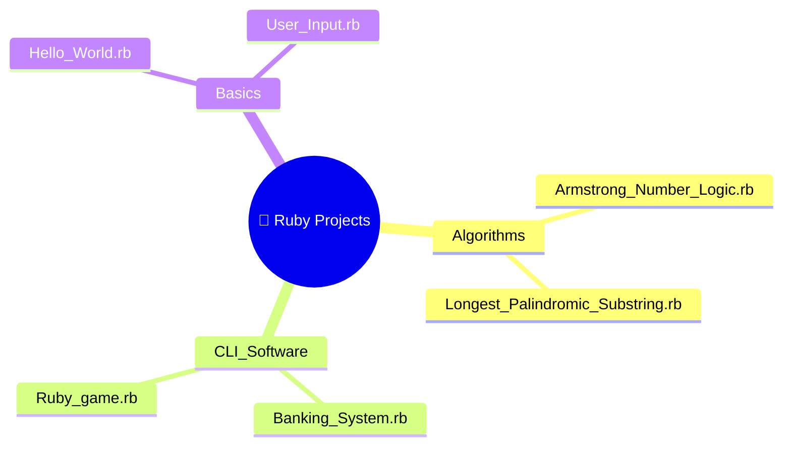

[⬅️ Back to Main Repository](../README.md)

---
<h1 align="center">💎 Ruby Projects</h1>

<p align="center">
  
  
  
</p>

<p align="center">
  <i>Elegant scripting, algorithm implementations, interactive games, and banking logic in Ruby.</i>
</p>

---

## 🗂️ Quick Navigation
| 🏠 | ⚙️ | 🎮 | ☕ | 🐍 | 💎 | 🦀 |
|:---:|:---:|:---:|:---:|:---:|:---:|:---:|
| [Main](../README.md) | [C/C++/C#](../C%20C%2B%2B%20C%23%20Projects/README.md) | [JS Games](../Games%20Using%20Vanilla%20JS/README.md) | [Java](../Java%20Projects/README.md) | [Python](../Python%20Projects/README.md) | **Ruby** | [Rust](../Rust%20Projects/README.md) |

---

## 📋 Table of Contents
- [About the Project](#-about-the-project)
- [File Index](#-file-index)
- [Folder Structure](#-folder-structure)
- [Key Features](#-key-features)
- [Tech Stack](#-tech-stack)
- [Getting Started](#-getting-started)
- [Author](#-author)

---

## 📖 About the Project

> A dedicated space showcasing **elegant scripting and algorithmic problem-solving through Ruby**. Known for its expressive, human-readable syntax, Ruby enables remarkably concise solutions to classic programming challenges. This directory spans basic I/O, interactive banking/game CLIs, and advanced string algorithm implementations like Longest Palindromic Substring.

---

## 📁 File Index

| File | Category | Description |
|---|---|---|
| `Banking System.rb` | CLI App | Full terminal banking flow with deposit/withdraw |
| `Ruby game .rb` | Game | Text-adventure or interactive game logic |
| `Armstrong Number  Logic.rb` | Algorithm | Identifies Armstrong numbers iteratively |
| `Longest Palindromic Substring .rb` | Algorithm | Dynamic string-scan for the largest palindrome |
| `User Input.rb` | Basics | Demonstrates `.gets.chomp` input patterns |
| `Hello World.rb` | Basics | Classic Ruby `puts "Hello, World!"` entry |

---

## 📂 Folder Structure



---

## ✨ Key Features
- **Armstrong Number Detection**: Iterates through a numeric range, computing digit-cubed sums to identify Armstrong (Narcissistic) numbers.
- **Palindromic Substring Search**: An O(n²) center-expansion algorithm that finds the longest palindromic substring within any input string.
- **Interactive Banking CLI**: `Banking System.rb` implements a looping menu with deposit, withdrawal, and balance check operations using Ruby's `gets.chomp` for smooth user input handling.
- **Idiomatic Ruby**: Utilizes `.times`, `.each`, `puts`, and other expressive Ruby idioms throughout.

---

## 🔧 Tech Stack
| Category | Details |
|---|---|
| **Language** | Ruby (MRI / CRuby) |
| **Libraries** | Standard library only |
| **Runtime** | Ruby interpreter |

---

## 🚀 Getting Started

### Prerequisites
Install Ruby on your machine. Verify with:
```bash
ruby -v
```

### Run Instructions

1. Navigate to this directory:
   ```bash
   cd "Academic-Projects-2024-2028/Ruby Projects"
   ```

2. Execute any Ruby script:

   | Script | Run Command |
   |---|---|
   | Banking System | `ruby "Banking System.rb"` |
   | Armstrong Numbers | `ruby "Armstrong Number  Logic.rb"` |
   | Palindromic Substring | `ruby "Longest Palindromic Substring .rb"` |
   | Ruby Game | `ruby "Ruby game .rb"` |

---

## 👤 Author

**Manthan Vinzuda**
> *Academic Projects · 2024–2028*