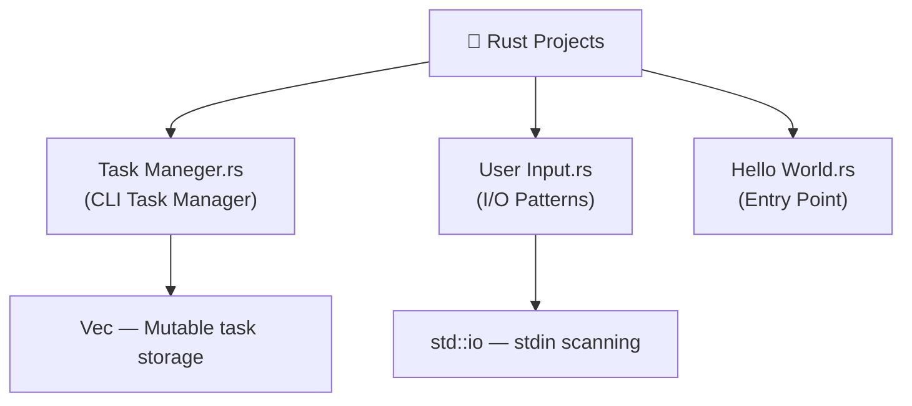

[⬅️ Back to Main Repository](../README.md)

---
<h1 align="center">🦀 Rust Projects</h1>

<p align="center">
  
  
  
</p>

<p align="center">
  <i>Exploring high-performance, memory-safe systems programming with Rust's ownership model.</i>
</p>

---

## 🗂️ Quick Navigation
| 🏠 | ⚙️ | 🎮 | ☕ | 🐍 | 💎 | 🦀 |
|:---:|:---:|:---:|:---:|:---:|:---:|:---:|
| [Main](../README.md) | [C/C++/C#](../C%20C%2B%2B%20C%23%20Projects/README.md) | [JS Games](../Games%20Using%20Vanilla%20JS/README.md) | [Java](../Java%20Projects/README.md) | [Python](../Python%20Projects/README.md) | [Ruby](../Ruby%20Projects/README.md) | **Rust** |

---

## 📋 Table of Contents
- [About the Project](#-about-the-project)
- [File Index](#-file-index)
- [Folder Structure](#-folder-structure)
- [Key Features](#-key-features)
- [Tech Stack](#-tech-stack)
- [Getting Started](#-getting-started)
- [Author](#-author)

---

## 📖 About the Project

> This section marks the entry into **high-performance, memory-safe systems programming with Rust**. Without a garbage collector yet with guaranteed memory safety, Rust enforces unique ownership rules at compile time. These projects explore the borrow checker, strict static typing, and CLI application building — from a simple Hello World to a fully interactive in-memory task manager.

---

## 📁 File Index

| File | Description |
|---|---|
| `Task Maneger.rs` | In-memory CLI task manager with add, list, and complete operations |
| `User Input.rs` | Demonstrates `std::io` stdin scanning and interactive input handling |
| `Hello World.rs` | Classic Rust entry point with `fn main()` and `println!()` macro |

---

## 📂 Folder Structure



---

## ✨ Key Features
- **Ownership & Borrow Checker**: Variables have strict ownership semantics — every reference borrows data explicitly as `&` (immutable) or `&mut` (mutable), preventing data races at compile time.
- **Task Manager CLI**: `Task Maneger.rs` creates an in-memory `Vec<Task>` that supports adding, listing, and marking tasks as complete through a loop-driven menu.
- **Standard I/O**: `User Input.rs` parses user input using `std::io::stdin().read_line()`, demonstrating Rust's explicit error-handling with `.unwrap()` or pattern matching.
- **Zero-Cost Abstractions**: Rust's trait system and pattern matching compile to native code with no runtime overhead.

---

## 🔧 Tech Stack
| Category | Details |
|---|---|
| **Language** | Rust (edition 2021) |
| **Compiler** | `rustc` |
| **Package Manager** | `cargo` (optional) |
| **Libraries** | `std::io`, `std::collections` |

---

## 🚀 Getting Started

### Prerequisites
Install the Rust toolchain via [rustup.rs](https://rustup.rs/):
```bash
curl --proto '=https' --tlsv1.2 -sSf https://sh.rustup.rs | sh
```
Verify:
```bash
rustc --version
```

### Run Instructions

1. Navigate to this directory:
   ```bash
   cd "Academic-Projects-2024-2028/Rust Projects"
   ```

2. **Compile and Run** with `rustc`:

   | Script | Compile | Run |
   |---|---|---|
   | Task Manager | `rustc "Task Maneger.rs"` | `"./Task Maneger"` |
   | User Input | `rustc "User Input.rs"` | `"./User Input"` |
   | Hello World | `rustc "Hello World.rs"` | `"./Hello World"` |

   > 💡 On **Windows**, executables are `.exe` files — run `"Task Maneger.exe"` in the terminal.

---

## 👤 Author

**Manthan Vinzuda**
> *Academic Projects · 2024–2028*